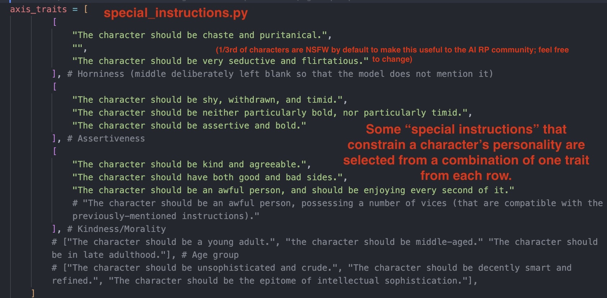
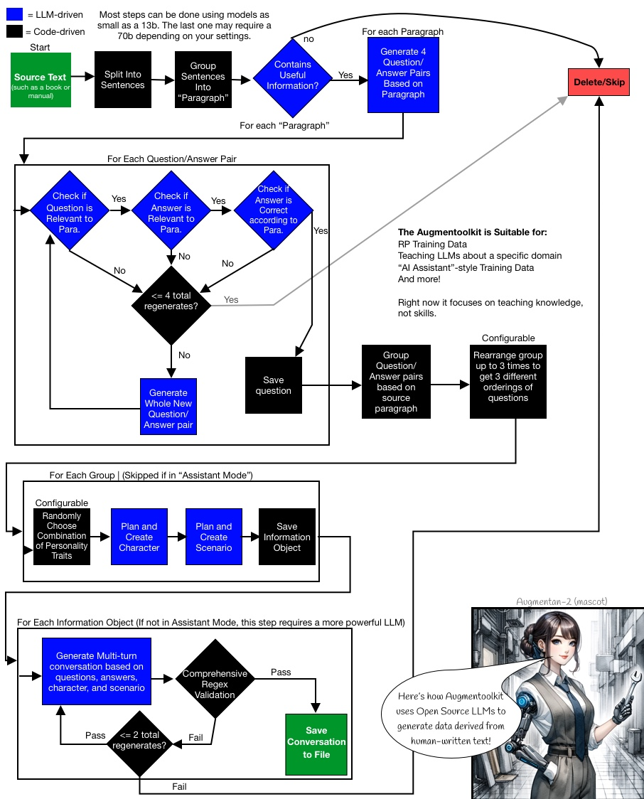

# Augmentoolkit — infinite domain-specific instruct data
Turn any raw text into a high-quality dataset using local models. Make data gathering a painless step of the model creation process. Augmentoolkit is the easy-to-use, customizable, open-source, and cost-effective data generation solution. No OpenAI needed.

Augmentoolkit now supports APIs offering open-source models, such as Mistral, Together.ai or Groq (and also the OpenAI API if you really want it). You don't need to have a fancy computer to make awesome datasets, and you don't have to screw around with dependencies and CUDA. The free credits from a service like Together.ai should be able to sustain the creation of even a decent-sized dataset. Data generation is also blazingly-fast (and async) when using APIs. Of course, you can still use local models, if you prefer that and have the compute to support it. They run async too, thanks to the Aphrodite engine made by the people at Pygmalion (thanks Alpin for the tech support).

## Demo video:
in-progress

## For Businesses
I work with AI SAAS startups that want to create (or improve) specialized LLMs using lots of quality training data. Do you need a dataset for your business's AI? I can modify Augmentoolkit for any domain and for tasks beyond question answering, and I'd be happy to help you painlessly create the data — and data-creation tools — you require. Given that I made the original version of the darn thing, I'm probably the best person in the world for this task. You can schedule a quick call to talk about your needs with me using this Calendly link: [https://calendly.com/evanpeterarmstrong/discovery-call](https://calendly.com/evanpeterarmstrong/discovery-call).

*Note* The base version Augmentoolkit is fully open sourced and MIT-licensed. The consulting option is for people who want a bespoke modification and quality results, fast (it took 5 months of learning and iteration for me to get the project to where it is now — prompting open models is a precise science). If you're a hobbyist and have time to experiment with it for casual or personal uses, by all means go for it.

## New Features At A Glance
- Runs Async with any LLM API (together, openrouter, mistral) that's compatible with the OpenAI python library
- A Python Script
- FAST: when using APIs, some datasets can be generated in under an hour, for <$10
- Options set in an easy-to-use YAML file, `config.py`. No more modifying code to change configuration.
- Supports both chat and completion prompts
- No More Clutter: output and raw text input paths configurable in the config file
- Easily switch between prompts by changing prompt folder paths. If a prompt is not found in the new folder it will fall back to the old one (the path to which is also configurable)
- A complete code refactor that makes customization much easier. No more editing prompts inside Python files, no more messing with control flow logic directly inside a Jupyter notebook.
- No switching between branches to use different methods of generation: switch between APIs and Aphrodite by changing the config file.

A (non-professional, roleplay-focused) Augmentoolkit dataset demonstration can be found at [https://huggingface.co/datasets/Heralax/Augmentoolkit-demo/tree/main](https://huggingface.co/datasets/Heralax/Augmentoolkit-demo/tree/main). It's from an older version of the pipeline that had a few bugs, but it helps you get the idea of what's possible, and proves that it produces quality stuff. Now, with many bugfixes and APIs that offer full-precision models, quality can be even higher.

## Table of Contents:
1. [Installation](#installation)
2. [Concepts Introduction](#introduction)
3. [Quickstart](#quickstart)
4. [Neat Features](#some-features-worth-being-aware-of)
5. [Customization (important)](#customization-arranged-in-order-of-least-to-most-difficult-to-implement)
6. [Hardcore, in-depth Concept Explanation](#hardcore-usage)
    - [Concepts and Operation](#concepts-and-operation)
    - [Understanding What is Going On as It Runs](#understanding-what-is-going-on-as-it-runs)
7. [The Format of the Output Data](#output-data-format)
8. [Think this is cool? Connect with me elsewhere!](#think-this-is-cool-connect-with-me-elsewhere)

## Installation:
Augmentoolkit, at its simplest, requires only the OpenAI API library (open source model providers use the OAI library too). So there is not much here besides cloning this repo and installing its dependencies (you probably already have most of them). Still, the details are here for completion's sake (and the newer enthusiasts among us).

First, get the repository onto your computer:
```
git clone https://github.com/e-p-armstrong/augmentool.git
```

Then, install the project's dependencies. For the API branch setup is super easy, you just need a handful of Python libraries: `protobuf sentencepiece transformers matplotlib nltk openai`. It should be as easy to install as:
```
pip install protobuf sentencepiece transformers matplotlib nltk openai
```
OR
```
pip install -r requirements.txt
```
You may get some messages saying that torchvision and torchaudio require older versions of Pytorch. This should be safely ignorable.

If you want to use Aphrodite, you'll also need to add
```
pip install aphrodite-engine
```
NOTE under basically all circumstances it will be more cost-efficient to use APIs instead of running this with local inference. There are plenty of API providers such as Together.ai that offer quality open source models at extremely cheap prices. Those are recommended for most users. You technically could rent out a GPU from vast.ai or runpod, copy this notebook over, install the dependencies, and run "local" inference using the aphrodite mode there... but it'll probably be more expensive than the alternative. Thus, you should probably only consider using local inference if your machine is beefy enough, and even then it may come at a significant cost in time.

For Mac users: since aphrodite-engine does not work on Mac, if you really want local inference you should start a [Llama cpp server]() on your computer, and add its url as the "api endpoint" in the config file. This is a bit tricky to do, and I don't know how to get it using RoPE scaling yet (needed for Augmentoolkit unless you're using a Mistral model), so your best bet would be to do some intense Googling and/or asking questions on the lcpp repo.

## Introduction

Dataset creation is currently the most painful, and most important, step of the finetune-creation process. Most people have to resort to either A) burning an obscene number of OpenAI API credits, or B) spending dozens, if not hundreds of hours accumulating a hybrid dataset based off of your own conversations with bots. The OpenAI approach is based on a paid service (whose TOS you're violating) that can ban you at any second, whose writing style you probably hate, and whose synthetic data critically lacks variety. Handwriting the examples is far too slow to iterate on, does not scale at all, and is (for open-source finetuners) not easily shareable due to the sensitive nature of private chats with bots. If you're a company and you pay people to create examples in bulk, then it's possibly pricier than even OpenAI — not scalable at all. And moreover, if we're literally creating machines that can write, why do we spend most of our time writing?

**Augmentoolkit** is meant to make high-quality data generation easy, fast, shareable, configurable, and for everyone. It is meant to allow the easy creation of datasets about any knowledge that exists in plain text. It is meant to allow models to bootstrap additional training data for themselves. It is meant to allow any enthusiast, regardless of computer strength, to contribute to the advancement of AI by generating swathes of data for cheap. It's meant to expand the possibilities of what finetunes can be built, by making data gathering as easy as running a script. Whether you're finetuning a company chatbot to understand your business's information, or are creating the latest RP model to top [Weicon's leaderboard](https://rentry.co/ayumi_erp_rating), Augmentoolkit exists to make your data problems a bit less problematic.

A flowchart of Augmentoolkit's operation can be found in the [Usage](#usage) section.

The high-level is: books or manuals in, information-rich conversations out. Train the model on the conversations, it learns the information. Extensive validation keeps hallucinations to a minimum.

More in-depth and jargon-filled:
Augmentoolkit takes human-written text with information in it, and turns it into instruct-tuning data: 
- It uses the text's information to generate questions that test the information, and it also generates answers to the questions that use the information. 
- It triple-checks whether the generated questions and answers are accurate and only use information provided in the text (ensuring that the LLM did not hallucinate new information). 
- Finally, it writes an interaction in a fictional setting between a character with domain expertise, and an ignorant secondary character, where the secondary character asks the questions and the primary character answers them. 
- After checking that this conversation faithfully includes the original questions and answers, the result is saved as part of the newly-generated dataset. The usage of characters and a setting means that the model's creative writing and RP skill can be improved at the same time as its knowledge base (but if you don't want an RP bot, you can always turn "Assistant Mode" on for user-assistant style interactions instead).
You can see a flowchart of this process over in [Usage](#usage).

**IMPORTANT Augmentoolkit can make conversations between fictional characters, or between a user and AI assistant. It does the former by default. The latter is probably better suited to professional use cases.**

## Quickstart:
After installing the dependencies:

- Get the repo onto a computer with an internet connection
- Install its dependencies
- Open `config.yaml`
- Paste your API key, favorite model name, and the endpoint URL of your preferred AI service, into the relevant fields inside `config.yaml`. Be sure to keep the quotes. Recommendation: [Together.ai with Hermes Mixtral works really nicely both as a LARGE_LOGICAL_MODEL and as the LOGICAL_MODEL](https://api.together.xyz/playground/chat/NousResearch/Nous-Hermes-2-Mixtral-8x7B-DPO).
- Either run all cells in the notebook `processing.ipynb`, or open this project's folder in a command line and type `python processing.py` and hit enter (fires off the script version).

***If you want to run a subset of the total text through the entire pipeline, to evaluate how well it works, turn on the USE_SUBSET flag in the config file (off by default)***

## Some features worth being aware of
This subsection describes things that make life easier in Augmentoolkit, particularly the new version.
- **Easy resume:** don't have long uninterrupted periods of time to run this? No problem! Augmentoolkit saves outputs as they're written and resumes generation painlessly, so you can start and stop stress free.
- **Two-model generation for the sake of SPEED:** every single task, except the very last one (multi-turn conversation generation) can be accomplished reliably by a good enough small model. But with APIs being as cheap as they are you can probably get away with running the whole thing using Mixtral anyway.
- **Validation, validation, validation:** Learning lessons from the original Augmental, consistency with the source text is an extremely high priority here, and this is ensured with multiple layers of LLM-based validation (and at the end, numerous examples of regex-based validation).
- **API-capable:** using the OpenAI API package, Augmentoolkit can now be powered by a host of Open-source model-providing APIs that are much cheaper and easier to use than running a GPU yourself, in most cases. For those of us with credits to spare, or with no fancy computers. Don't worry, it asynchronously uses the API, because your time is valuable.
- **Quality of Life:** with configurable paths for prompts, inputs, and outputs; a prompt override system; changing between local and API inference with a single field in a config file; and more added features, Augmentoolkit is actually kinda nice to use now. It's now a proper, solid program, not just a proof of concept.
- **Holy crap is it fast:** No more waiting for days while your GPU chugs along. If you're using a fast API, your speeds will be *blazing*. All the examples you see in ./example_generated_convs took like 20 minutes to generate from start to finish using Hermes Mixtral via Together.ai.

## Customization (arranged in order of least-to-most difficult to implement):
Read this to learn how to hack Augmentoolkit for your own use cases. Augmentoolkit is way easier to customize now that it uses a `.yaml` file. **If you're new to programming, .yaml isn't scary, trust me.**

1. ***Change the source texts used to generate training data.*** You do this by placing the .txt files you want to use in an input folder (by default, `raw_txt_input/`), and pointing Augmentoolkit at that folder by specifying it in `config.yaml`. So, move the files you want to turn into datasets into or out of that folder. **IF YOU TURN `USE_FILENAMES` ON IN CONFIG.YAML** then the filenames of these inputs should be formatted in a specific way, since the filenames are used as part of the prompts and in at least one regex. You need to have them be like: `[textname], by authorname`. So for example, `Simple Sabotage, by the Office of Strategic Services`. You can also include the publication date after the author name if you want (as in `Principles of Chemistry, by Demitry Mendeleev, published 1897`), but note that this may bias most of the characters to live in the era of the textbook, which may or may not be what you want. `USE_FILENAMES` is off by default, and that means the notebook just shows the model the text in each file now. The model sometimes mentions "the text" even if use_filenames is off IF you run in completion mode, also this is somewhat model-dependent. **Finally, if you have a PDF you want to use as a source text, you can convert it to a .txt using `./convert_pdf_to_text.py` (just change the `pdf_path` in the code, and run the script, or use an online conversion tool).** If you want a good source of plaintext documents, [try Project Gutenberg](https://www.gutenberg.org/); if you want educational PDFs, try [OpenStax](https://openstax.org/subjects).


2. ***Change the settings.*** There are a few constant values in Augmentoolkit, all configurable from `config.yaml` (the latter is only really used when testing prompts during development). **WHAT EVERY SINGLE SETTING DOES IS DOCUMENTED EXTENSIVELY INSIDE CONFIG.YAML, here a comprehensive overview is given on WHEN and WHY you might want to change some things.** Some settings make sense to change frequently, based on the project. These include things like `USE_FILENAMES`, which should be turned off if you haven't named your input text according to a specific format; `USE_SUBSET`, which should be turned on if you want to quickly test out how a single source text performs in the pipeline; and `REARRANGEMENTS_TO_TAKE` which decides how many unique conversations Augmentoolkit will try to generate from each group of question-answer pairs. `COMPLETION_MODE` should be turned off only if your API doesn't support text completion — the quality is higher with it on. Then there are the settings that deal more with specifics and details: things like `DOUBLE_CHECK_COUNTER` or `CONCURRENCY_LIMIT` which you should only mess with if you have specific technical requirements. **NEW! With USE_FILENAMES being added, You no longer need to manually title all the files you use as input!** And it's probably better if you don't because that way the model isn't as constrained to the time period it associates with your book. This should make truly bulk work much easier. Just use `COMPLETION_MODE` for fewer bugs. APIs that don't offer completion are typically bad at continuing patterns anyway and will have higher error rates.

3. ***Change the personalities of the characters generated.*** Currently, when generating characters for the multi-turn conversation step, three randomly-selected traits are appended to the "special instructions" set of the prompt to constrain what kind of character is generated by the model. Depending on what kind of model you want to make, or even just if your preferences vary, then you will probably want to modify this a bit. You can do so in `./augmentoolkit/generation_functions/special_instructions.py`. A more in-depth description of the trait-axis system that I (over)thought up is available in the comments of that file. **NOTE: Personalities are not generated when using the more-professional ASSISTANT_MODE. The entire scenario generation and character generation part of the pipeline is skipped. This makes things cheaper and cleaner, if a bit less varied.** 



4. ***Assistant Mode (IMPORTANT for professional users)*** Technically this could be considered part of 3), but it's different enough that I feel it warrants separate explanation. By default, the notebook is configured to produce RP-style data; "Assistant mode" is something you can toggle in `config.yaml`. It skips character and scenario generation and answers every question in a chat between a user and a helpful AI assistant (with no personality). In the limited testing I have done with this, **it seems that assistant mode is simple enough to work entirely with 13b models** such as Flatorcamaid by Ikari (helluva name, I know, but it's a good model). So if your compute or time are very limited, or you are using this for a more professional use case, feel free to turn this on.

5. ***Change the model.*** This is as simple as switching the LOGICAL_MODEL value out for another one, and modifying your `BASE_URL` if you're changing to a different API, but your mileage may vary significantly. My personal recommendation is to use [Hermes Mixtral DPO](https://api.together.xyz/playground/chat/NousResearch/Nous-Hermes-2-Mixtral-8x7B-DPO) for both models. You need at least 12k context on your model, and APIs typically don't allow RoPE scaling, so you're probably limited to MistralAI models here (or, heavens forbid, OpenAI. But GPT-4.5 + Augmentoolkit will BANKRUPT you fast, so be wary). Mistral.ai models are offered via their API, or via open source model APIs like Together.ai or Groq. I recommend using Together with [Hermes Mixtral]((https://api.together.xyz/playground/chat/NousResearch/Nous-Hermes-2-Mixtral-8x7B-DPO).): Mistral.ai's API seems to have instruct tuning that interferes with its ability to follow pattens set out by examples, resulting in worse performance and a severely elevated error rate when running Augmentoolkit. Mistral also doesn't offer a completion API. Details about some possible values for `BASE_URL` are available in `config.yaml`.

6. ***Change the examples.*** Augmentoolkit now allows for easy switching between prompt groups for different projects/runs, just change the `DEFAULT_PROMPTS` and `PROMPTS` paths in `config.yaml`. Augmentoolkit first looks in `PROMPTS` for the file with the right name for a given step, then moves onto `DEFAULT_PROMPTS` if it can't find it. Changing prompts is recommended if you have a type of input text that's pretty far off from what Augmentoolkit's built to handle (information-rich text such as textbooks or manuals). However, while managing prompts is easier now, writing them is still hard. Here, you should focus on changing the examples, and even then, you should focus on changing a few specific files that do not generalize as well as the others. Augmentoolkit by default is very generalist, having a bit of RP and being capable of decently creating data for factual and philosophical texts. But this general capability hurts its specific task performance. **Specific few-shot examples I recommend looking into changing first, if you want to radically adapt what Augmentoolkit does: `generate_questions generate_new_question judge_paragraph` for modifying the questions you generate and controlling what gets sent to question generation; `multi_turn_convs` for adapting the conversations to the types of question you ask. If you want to, you can change the types of characters generated using `create_character_card_plan_many_tuples`, `create_character_card_many_tuples`, and `multi_turn_conversation`.** Changing prompts is hard so only change what you need. Validation too open and permissive? Change only `judge_paragraph`. The model asks the wrong kinds of question? Change the question generation prompts. Your new questions keep getting flagged by validation? Change the validation examples (just work through the reasoning steps yourself for the example (or get GPT-4 to do it) but have the example reach the correct conclusion). Don't like the writing style? Change `multi_turn_conversation.py`. Modifying the examples is by far the hardest modification you can make, but it also affords the most control, and will help ensure the quality you need for very specific or professional projects. It also happens to be what I specialize in, so if you have a professional project that you need Augmentoolkit adapted for, don't hesitate to [chat with me about it!](https://calendly.com/evanpeterarmstrong/discovery-call)


## Hardcore Usage

This section is seriously in-depth and is not required for casual use. You only need it if you're hardcore-modifying Augmentoolkit. It's primarily meant for people who will be changing the code, and who'd like a head start in grasping how all the moving pieces fit together. Because it sucks to use a newly-released framework and have to try to piece together the developer's understanding of the project from scratch.

How to get this running at a basic level is covered in [Quickstart](#quickstart). This section describes what you're actually doing while you're running this, as well as how to easily customize the function of this project for your own use cases. It describes everything from how to operate the project (in greater detail) to how everything's structured, and what folders to watch as you are generating your data. For the most part you can just follow quickstart, but this section may be worth reading if you plan to make this a serious part of your model creation (which I hope you do!).

Here is a flowchart detailing how a typical run of Augmentoolkit may proceed. The source text can be anything with information you can ask questions about.


### Concepts and Operation
Read this subsection for a slightly more detailed version of the more finicky bits of the quickstart, as well as an understanding of the key files in this repo.
Augmentoolkit has a Jupyter notebook, `processing.ipynb`, and a script, `processing.py`. All the prompts are stored in `./prompts/` and are text or JSON files for maximal editing convenience. A complete code overhaul has dramatically reduced repetition, too. Augmentoolkit has never been so easy to modify.

You run Augmentoolkit by running all cells in the Jupyter Notebook `processing.ipynb`, or by running the python script. **You no longer need to restart the notebook, even if doing part of the generation with a smaller model, when you're using an API.** ***A restart is still required if you're using it in Aphrodite mode!!!***

***Important files:*** The core of the project is the script/notebook. The two are essentially equivalent: the script was created by exporting the notebook and adding a few lines to make it work async. Whichever one you use, it needs `./augmentoolkit/` for some imports, some prompts in `./prompts/` (or whatever you change it to in the config), and a folder with text documents to read in (by default, `./raw_text_input/`). All these folders should ideally be in the same folder as the script and notebook. If you are going to change anything, please read [Customization](#customization-arranged-in-order-of-least-to-most-difficult-to-implement) first.

### Understanding what is going on as it runs
This subsection summarizes output folders and code structure. It is primarily useful if you intend to modify the code of Augmentoolkit. 

**Design philosophy:** I considered structuring this project in such a way that it would become very abstract, each pipeline step would be an object, etc... but this is not trying to be langchain, or any kind of agent framework. Or a pipeline framework. Augmentoolkit is a program, not a framework, and it's specifically for generating data. I believe that for most use cases here, Python code is the correct level of abstraction. That being said, it helps to know how this particular code is currently structured before you go changing it, if you have a slightly different use case in mind. Some of the features present here, like the engine wrapper and generation step classes, will probably be preserved in any modification or fork that you make.

**Output folders:** Augmentoolkit makes plenty of folders while it runs. However they're all nicely contained in whatever you specify the `OUTPUT` folder to be (specified in `config.yaml`). The output folder contains both files that are being saved just in case a future model is trained to run this pipeline specifically, and the ones that are explicitly intermediate steps, saved in case a run is paused and you want to resume later. The intermediate folders ones you may want to pay attention to are `./worthy_for_questions`, `./qatuples_raw`, `./qatuples_revised`, `./multiturn_convs_info`, and finally, `./multiturn_convs`. `./multiturn_convs` is the final output directory, from which the final dataset files `master_list.jsonl`, `processed_masterlist.json`, and `simplified_data.jsonl` (sharegpt format) are created. Everything else is just the notebook saving the outputs of every single step in case someone (or myself) wants to train a model specifically for running this pipeline at some point.

Do not move or remove the folders as they're generated.

**As for code structure,** `processing.ipynb` (or `.py` as the case may be) is a relatively lightweight wrapper for the control flow code in `./augmentoolkit/control_flow_functions/control_flow_functions.py`, which focuses on passing output from one discrete step of the pipeline to the other, and loading and saving to files. It's essentially the interface. If you've used Augmentoolkit before the great refactoring of 24/02/19, know that all the messy logic now hides in `control_flow_functions.py`. Out of sight, out of mind.

The `./augmentoolkit/generation_functions` holds a few helper functions, and a few essential classes. `engine_wrapper_class.py` holds the logic for making calls to whatever LLM-providing service you're using; `generation_step_class.py` is a class that submits calls to `engine_wrapper_class.py`. Instances of the class represent a step in the pipeline, such as generating questions or conversations. Its purpose is to prevent the control flow code from having to manage prompts or inference code. You pass in the path to a prompt, some settings, and an output processor, and then calling .generate() on it fulfills the same role that the dozen-or-so separate functions in `generation_functions/` once did. So basically: `generation_step_class.py` is an abstracted-away way to handle gathering the inputs to the engine wrapper.

Inside `./augmentoolkit/control_flow_functions`, note that `write_output_to_file()` can mostly be ignored; it just saves the full completion of each step for the sake of potential future training of a model specifically for running this pipeline (think jondurbin/cinematika-7b-v0.1). The main output of the function is usually just passed onto the next part of the pipeline. If a file has been written already, any future attempts to write that file will be skipped, allowing for easy resumption of generation after interruption.

**Prompts** All prompts are in `prompts/`. You can specify two prompt folder paths: the `DEFAULT_PROMPTS` path and the `PROMPTS` path. Augmentoolkit first looks in `PROMPTS` and then falls back to `DEFAULT_PROMPTS` if it can't find the correctly-named file for its step. This is useful if you want to change prompts between different projects by overriding specific prompts in `prompts/`. By default, no prompts are overridden.

**Completion Mode:** If completion mode is on, then the pipeline treats the model more like autocomplete than a conversation. This typically has *much* better performance and quality, but not all APIs support completion mode (Mistral doesn't, OpenAI doesn't) so you may need to turn this off depending on your provider. If it's on, Augmentoolkit uses `.txt` files in whatever prompt folders it's been given; if it's off, it uses the `.json` files.

It's easiest to understand Augmentoolkit as being an LLM pipeline: it takes a bunch of input, calls a series of LLM modifications on it (passing the output from one step to the next) and outputs the transformed result. This is somewhat different from an agent framework like LangChain because the AI doesn't actually reason about what step to do next; the logic is hardcoded and hand-prompted.

## Output data format: 
**Augmentoolkit outputs data both in its own format and in ShareGPT at the end.** Its own format is the following:
```
[
[
'something', # this is the conv
'something', #character card
'something', # Chain of Thought generations used to plan the scenario. Some of the later steps could possibly be useful context to append to the character card, so the entire thing is included incase you need it for your purposes. for an example of how this might be added to a character card, look at the prompts for 
[['q','a','source_paragraph'],...up to 4 times...]
],
...repeated for each conversation you generated
]
```
Things are accessed by index, which makes it more just a pure list format than JSON. **Of course you can also just convert to ShareGPT using the cell at the very end, but that loses some info.**


## Think this is cool? Connect with me elsewhere!

If you think this project is cool and useful, great! I'm genuinely happy that you're interested by my work. If you're really interested by this project you might be interested by some of my other endeavors:

[A newsletter/blog about Prompt Engineering Open-Source models — the art and science that is the backbone of Augmentoolkit and complex LLM projects like it. I also consult for prompt engineering, if you're curious.](https://promptingweekly.substack.com/)
[I sometimes post stuff and sometimes join spaces on X/Twitter](https://twitter.com/e_p_armstrong)
[Let's connect on LinkedIn!](https://www.linkedin.com/in/evan-armstrong-1a84b3200/)
[I'm pretty active on TheBloke's discord server and a bunch of other AI discords. Find me as @heralax!](https://discord.gg/prYqwywP)
[By the way, did I mention I consult? :) I might be able to help your AI business get even better, using Augmentoolkit or straight-up prompting. We should chat at least and connect](https://calendly.com/evanpeterarmstrong/discovery-call)

