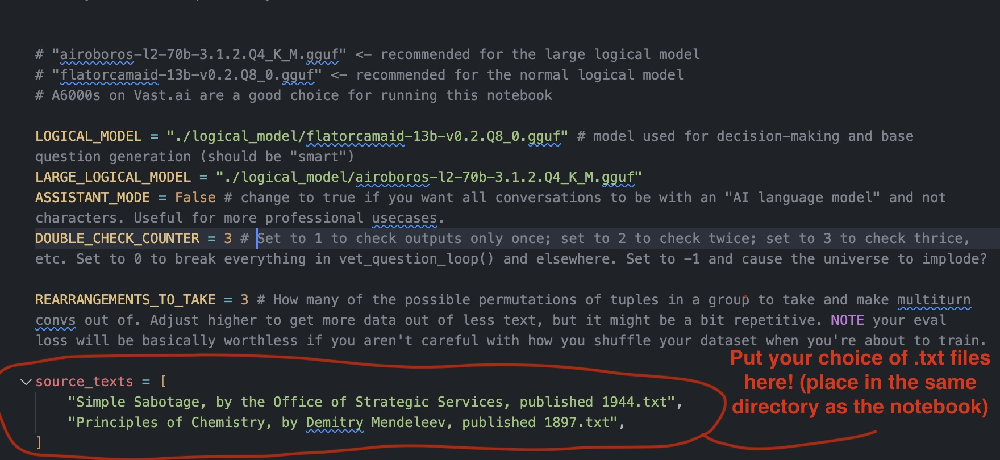

# Augmentoolkit
Generate multi-turn training data, about any subject, using Open Source LLMs!
Save yourself the time of manually editing 1000s of AI chats to build your own dataset (which you then can't open source anyway because of personal reputation risks). Easily configure the prompts and settings to generate conversations aligned to your tastes and interests.
Now designed for use with APIs offering open-source models, so you don't have to have a fancy computer to make awesome datasets, and you don't have to screw around with dependencies and CUDA. The free credits on services such as [Together.ai]("https://www.together.ai/") should be enough to make a good dataset in its entirety — they offer Mixtral at prices like $0.6/1 Million Tokens(!)

## New Features At A Glance
- Python Script
- Runs Async with any LLM API (together, openrouter, mistral) that's compatible with the OpenAI python library
- Quite fast: when using APIs, some datasets can be generated in under an hour, for <$10
- Options set in an easy-to-use YAML file, `config.py`. No more modifying code to change configuration.
- Supports both chat and completion prompts
- No More Clutter: output and raw text input paths configurable in the config file
- Easily switch between prompts by changing prompt folder paths. If a prompt is not found in the new folder it will fall back to the old one (the path to which is also configurable)
- A complete code refactor that makes customization much easier. No more editing prompts inside Python files, no more messing with control flow logic directly inside a Jupyter notebook.
- No switching between branches to use different methods of generation: switch between APIs and Aphrodite by changing the config file.

[Fork this repo and customize it for your own needs!](https://github.com/e-p-armstrong/augmentoolkit/fork)

**The Version Using Aphrodite Engine (based on vLLM) is updated and recommended for most usecases!** (This means batched inference, GPTQ/AWQ support, hundreds of tokens per second, and asynchronous operations for a much faster experience). [Try it now!](https://github.com/e-p-armstrong/augmentoolkit/tree/aphrodite-branch)

## Table of Contents:
1. [Installation](#installation)
2. [Introduction](#introduction-what-is-this-and-why-was-it-built)
3. [Quickstart](#quickstart)
4. [Usage](#usage)
    - [Concepts and Operation](#concepts-and-operation)
    - [Understanding What is Going On as It Runs](#understanding-what-is-going-on-as-it-runs)
    - [Some Features Worth Being Aware Of](#some-features-worth-being-aware-of)
5. [Customization](#customization-arranged-in-order-of-least-to-most-difficult-to-implement)
6. [General Notes, Known Limitations, Quirks, Features](#general-notes-known-limitations-quirks-features)
    - [Why is it writing so many files?](#why-is-it-writing-so-many-files)
    - [Known Limitations (and Potential Solutions)](#known-limitations)
7. [Contributing](#contributing)
    - [Improvement Areas](#obvious-areas-for-improvement-feel-free-to-open-a-pr)
8. [Contact](#contact)

## Installation:
Augmentoolkit, at its simplest, requires only the OpenAI API library (open source model providers use the OAI library too). So there is not much here besides cloning this repo and installing its dependencies (you probably already have most of them). Still, the details are here for completion's sake (and the newer enthusiasts among us).

First, get the repository onto your computer:
```
git clone https://github.com/e-p-armstrong/augmentool.git
```

Then, install the project's dependencies. For the API branch setup is super easy, you just need a handful of Python libraries: `protobuf sentencepiece transformers matplotlib nltk openai`. It should be as easy to install as:
```
pip install protobuf sentencepiece transformers matplotlib nltk openai
```
OR
```
pip install -r requirements.txt
```
You may get some messages saying that torchvision and torchaudio require older versions of Pytorch. This should be safely ignorable.

If you want to use Aphrodite, you'll also need to add
```
pip install aphrodite-engine
```

NOTE under basically all circumstances it will be more cost-efficient to use APIs instead of running this with local inference. There are plenty of API providers such as Together.ai that offer quality open source models at extremely cheap prices. Those are recommended for most users. You technically could rent out a GPU from vast.ai or runpod, copy this notebook over, install the dependencies, and run "local" inference using the aphrodite mode there... but it'll probably be more expensive than the alternative. Thus, you should probably only consider using local inference if your machine is beefy enough, and even then it may come at a significant cost in time.

For Mac users: since aphrodite-engine does not work on Mac, if you really want local inference you should start a [Llama cpp server]() on your computer, and add its url as the "api endpoint" in the config file. This is a bit tricky to do, and I don't know how to get it using RoPE scaling yet (needed for Augmentoolkit), so your best bet would be to do some intense Googling and/or asking questions on the lcpp repo.

## Introduction: What is this and why was it built?
Open source is meant to move fast, be shareable, and be novel. Our datasets are none of these. Most of the top models have private datasets (or are merges), and replicating said datasets often either A) requires an obscene number of OpenAI API credits, or B) requires you, the model creator, to spend dozens if not hundreds of hours accumulating a hybrid dataset based off of your own conversations with bots. The former is based on a paid service (whose TOS you're violating) that can ban you at any second and whose writing style you probably hate; the latter is far too slow to iterate on, does not scale at all, and is not easily shareable due to the sensitive nature of private chats with bots. And moreover, if we're literally creating machines that can write, why do we spend most of our time writing?

**Augmentoolkit** is meant to make high-quality data generation easy, fast, shareable, configurable, and open-source. It is meant to allow the easy creation of datasets about any knowledge base that exists in plain text. It is meant to allow models to bootstrap additional training data for themselves. It is meant to allow any enthusiast, regardless of computer strength, to contribute to the advancement of open source AI by generating swathes of data. It's meant to help narrow the gap between OpenAI's obscenely large dataset, and what we have in the land of Open Source. Whether you're making a finetune on a specific domain, or are creating the latest RP model to top [Weicon's leaderboard](https://rentry.co/ayumi_erp_rating), Augmentoolkit exists to make your data problems a bit less problematic.

A flowchart of Augmentoolkit's operation can be found in the [Usage](#usage) section.

Conceptually, Augmentoolkit takes human-written text with information in it, and turns it into instruct-tuning data: 
- It uses the text's information to generate questions that test the information, and it also generates answers to the questions that use the information. 
- It triple-checks whether the generated questions and answers are accurate and only use information provided in the text (ensuring that the LLM did not hallucinate new information). 
- Finally, it writes an interaction in a fictional setting between a character with domain expertise, and an ignorant secondary character, where the secondary character asks the questions and the primary character answers them. 
- After checking that this conversation faithfully includes the original questions and answers, the result is saved as part of the newly-generated dataset. The usage of characters and a setting means that the model's creative writing and RP skill can be improved at the same time as its knowledge base (but if you don't want an RP bot, you can always turn "Assistant Mode" on for user-assistant style interactions instead).
You can see a flowchart of this process over in [Usage](#usage).

The name "Augmentoolkit" comes from "Augmented data" (my own coined phrase for human-written text that is AI-reformatted, since I [couldn't find a standardized one](https://xkcd.com/927/)) and "toolkit".

## Quickstart:
After installing the dependencies:

- Get the repo onto a computer with an internet connection
- Install its dependencies
- Open `config.yaml`
- Paste your API key, favorite model name, and the endpoint URL of your preferred AI service, into the relevant fields inside `config.yaml`. Be sure to keep the quotes. Recommendation: [Together.ai with Hermes Mixtral works really nicely both as a LARGE_LOGICAL_MODEL and as the LOGICAL_MODEL](https://api.together.xyz/playground/chat/NousResearch/Nous-Hermes-2-Mixtral-8x7B-DPO).
- Either run all cells in the notebook `processing.ipynb`, or open this project's folder in a command line and type `python processing.py` and hit enter (fires off the script version).

***If you want to run a subset of the total text through the entire pipeline, to evaluate how well it works, turn on the USE_SUBSET flag in the config file (off by default)***

## Usage
How to get this running at a basic level is covered in [Quickstart](#quickstart). This section describes what you're actually doing while you're running this, as well as how to easily customize the function of this project for your own use cases. It describes everything from how to operate the project (in greater detail) to how everything's structured, and what folders to watch as you are generating your data. For the most part you can just follow quickstart, but this section may be worth reading if you plan to make this a serious part of your model creation (which I hope you do!).

Here is a flowchart detailing how a typical run of Augmentoolkit may proceed. The source text can be anything with information you can ask questions about.


### Concepts and Operation
Read this subsection for a slightly more detailed version of the more finicky bits of the quickstart, as well as an understanding of the key files in this repo.
Augmentoolkit has a Jupyter notebook, `processing.ipynb`, and a script, `processing.py`. All the prompts are stored in `./prompts/` and are text or JSON files for maximal editing convenience. A complete code overhaul has dramatically reduced repetition, too. Augmentoolkit has never been so easy to modify.

You run Augmentoolkit by running all cells in the Jupyter Notebook `processing.ipynb`, or by running the python script. **You no longer need to restart the notebook, even if doing part of the generation with a smaller model, when you're using an API.** ***A restart is still required if you're using it in Aphrodite mode!!!***

***Important files:*** The core of the project is the script/notebook. The two are essentially equivalent: the script was created by exporting the notebook and adding a few lines to make it work async. Whichever one you use, it needs `./augmentoolkit/` for some imports, some prompts in `./prompts/` (or whatever you change it to in the config), and a folder with text documents to read in (by default, `./raw_text_input/`). All these folders should ideally be in the same folder as the script and notebook. If you are going to change anything, please read [Customization](#customization-arranged-in-order-of-least-to-most-difficult-to-implement) first.

### Understanding what is going on as it runs
This subsection summarizes output folders and code structure. It is primarily useful if you intend to modify the code of Augmentoolkit. I considered structuring this project in such a way that it would become very abstract, each pipeline step would be an object, etc... but this is not trying to be langchain, or any kind of agent framework. Or a pipeline framework. Augmentoolkit is a program, not a framework, and it's specifically for generating data. I believe that for most use cases here, Python code is the correct level of abstraction. That being said, it helps to know how this particular code is currently structured before you go changing it, if you have a slightly different use case in mind. Some of the features present here, like the engine wrapper and generation step classes, will probably be preserved in any modification or fork that you make.

Augmentoolkit makes plenty of folders while it runs. However, unlike before, they're now all nicely contained in whatever you specify the `OUTPUT` folder to be (in config.yaml). Augmentoolkit automatically creates this at the start of a run. The output folder contains both files that are being saved just in case a future model is trained to run this pipeline specifically, and the ones that are explicitly intermediate steps, saved in case a run is paused and you want to resume later. The intermediate folders ones you may want to pay attention to are `./worthy_for_questions`, `./qatuples_raw`, `./qatuples_revised`, `./multiturn_convs_info`, and finally, `./multiturn_convs`. `./multiturn_convs` is the final output directory, from which the final dataset files `master_list.jsonl`, `processed_masterlist.json`, and `simplified_data.jsonl` (sharegpt format) are created. Everything else is just the notebook saving the outputs of every single step in case someone wants to train a model specifically for running this pipeline at some point.

Do not move or remove the folders as they're generated.

As for code structure, `processing.ipynb` (or `.py` as the case may be) is a relatively lightweight wrapper for the control flow code in `./augmentoolkit/control_flow_functions/control_flow_functions.py`, which focuses on passing output from one discrete step of the pipeline to the other, and loading and saving to files. It's essentially the interface. If you've used Augmentoolkit before the great refactoring of 24/02/19, know that all the messy logic now hides in `control_flow_functions.py`. Out of sight, out of mind.

The `./augmentoolkit/generation_functions` holds a few helper functions, and a few essential classes. `engine_wrapper_class.py` holds the logic for making calls to whatever LLM-providing service you're using; `generation_step_class.py` is a class that submits calls to `engine_wrapper_class.py`. Instances of the class represent a step in the pipeline, such as generating questions or conversations. Its purpose is to prevent the control flow code from having to manage prompts or inference code. You pass in the path to a prompt, some settings, and an output processor, and then calling .generate() on it fulfills the same role that the dozen-or-so separate functions in `generation_functions/` once did. So basically: `generation_step_class.py` is an abstracted-away way to handle gathering the inputs to the engine wrapper.

Inside `./augmentoolkit/control_flow_functions`, note that `write_output_to_file()` can mostly be ignored; it just saves the full completion of each step for the sake of potential future training of a model specifically for running this pipeline (think jondurbin/cinematika-7b-v0.1). The main output of the function is usually just passed onto the next part of the pipeline. If a file has been written already, any future attempts to write that file will be skipped, allowing for easy resumption of generation after interruption.

It's easiest to understand Augmentoolkit as being an LLM pipeline: it takes a bunch of input, calls a series of LLM modifications on it (passing the output from one step to the next) and outputs the transformed result. This is somewhat different from an agent framework like LangChain because the AI doesn't actually reason about what step to do next; the logic is hardcoded and hand-prompted.

Since previous versions of the README omitted this key information: **the notebook outputs data both in its own format and in ShareGPT at the end.** Its own format is the following:
```
[
[
'something', # this is the conv
'something', #character card
'something', # Chain of Thought generations used to plan the scenario. Some of the later steps could possibly be useful context to append to the character card, so the entire thing is included incase you need it for your purposes.
[['q','a','source_paragraph'],...up to 4 times...]
],
...repeated for each conversation you generated
]
```
Things are accessed by index, which makes it more just a pure list format than JSON. **Of course you can also just convert to ShareGPT using the cell at the very end, but that loses some info.**

### Some features worth being aware of
This subsection describes things that make life easier in Augmentoolkit.
- **Easy resume:** don't have long uninterrupted periods of time to run this? No problem! Augmentoolkit saves outputs as they're written and resumes generation painlessly, so you can start and stop stress free.
- **Two-model generation for the sake of SPEED:** every single task, except the very last one (multi-turn conversation generation) can be accomplished reliably by a good enough small model. But with APIs being as cheap as they are you can probably get away with running the whole thing using Mixtral anyway.
- **Validation, validation, validation:** Learning lessons from the original Augmental, consistency with the source text is an extremely high priority here, and this is ensured with multiple layers of LLM-based validation (and at the end, numerous examples of regex-based validation).
- **API-capable:** using the OpenAI API package, Augmentoolkit can now be powered by a host of Open-source model-providing APIs that are much cheaper and easier to use than running a GPU yourself, in most cases. For those of us with credits to spare, or with no fancy computers. Don't worry, it asynchronously uses the API, because your time is valuable.
- **Quality of Life:** with configurable paths for prompts, inputs, and outputs; a prompt override system; changing between local and API inference with a single field in a config file; and more added features, Augmentoolkit is actually kinda nice to use now. It's now a proper, solid program, not just a proof of concept.
- **Holy crap is it fast:** No more waiting for days while your GPU chugs along. If you're using a fast API, your speeds will be *blazing*. All the examples you see in ./example_generated_convs took like 20 minutes to generate from start to finish using Hermes Mixtral via Together.ai.

The steps above describe how to run the notebook with default settings. But your use case likely differs from the default. Here's a step-by-step process about how to customize it!
### Customization (arranged in order of least-to-most difficult to implement):
Read this to learn how to hack Augmentoolkit for your own use cases.
1. ***Change the source texts used to generate training data.*** You do this by placing the .txt files you want to use in an input folder, and pointing Augmentoolkit at that folder by specifying it in `config.yaml`. **IF YOU TURN USE_FILENAMES ON** then the filenames of these inputs should be formatted in a specific way, since the filenames are used as part of the prompts and in at least one regex. You need to have them be like: `[textname], by authorname`. So for example, `Simple Sabotage, by the Office of Strategic Services`. You can also include the publication date after the author name if you want (as in `Principles of Chemistry, by Demitry Mendeleev, published 1897`), but note that this may bias most of the characters to live in the era of the textbook, which may or may not be what you want. `USE_FILENAMES` is off by default, and that means the notebook just shows the model the text in each file now. **Also, if you have a PDF you want to use as a source text, you can convert it to a .txt using `./convert_pdf_to_text.py` (just change the target string in the code, and run the script).** If you want a good source of plaintext documents, [try Project Gutenberg](https://www.gutenberg.org/); if you want educational PDFs, try [OpenStax](https://openstax.org/subjects).



2. ***Change the personalities of the characters generated.*** Currently, when generating characters for the multi-turn conversation step, three randomly-selected traits are appended to the "special instructions" set of the prompt to constrain what kind of character is generated by the model. Depending on what kind of model you want to make, or even just if your preferences vary, then you will probably want to modify this a bit. You can do so in `./generation_functions/special_instructions.py`. A more in-depth description of the trait-axis system that I (over)thought up is available in the comments of that file.


3. ***Change the constants.*** There are a few constant values in Augmentoolkit, all configurable from `config.yaml` (the latter is only really used when testing prompts during development). These constants are tested, but if your use case requires special settings (e.g., you want to make conversations from more permutations of existing questions; or you think the character counts for the "duplicate question/answer" validation functions are too restrictive) then feel free to change the related setting. The most intuitive and least-likely-to-break-anything settings to change are rearrangements_to_take and double_check_counter. Beyond that... you'll need to figure out what the function does before changing it if you expect it to run. **NEW! You no longer need to manually title all the files you use as input!** And it's probably better if you don't because that way the model isn't as constrained to the time period it associates with your book. This should make truly bulk work much easier.

4. ***Assistant Mode*** Technically this could be considered part of 3), but it's different enough that I feel it warrants separate explanation. By default, the notebook is configured to produce RP-style data; "Assistant mode" is something you can toggle in the settings cell immediately below this one, which skips character and scenario generation and answers every question in a chat between a user and a helpful AI assistant (with no personality). In the limited testing I have done with this, **it seems that assistant mode is simple enough to work from start-to-finish with 13b models** such as Flatorcamaid by Ikari. So if your compute or time are very limited, or you are using this for a more professional use case, feel free to turn this on.

5. ***Change the model.*** This is as simple as switching the LOGICAL_MODEL value out for another one, but your mileage may vary significantly. My personal recommendation is to use [Hermes Mixtral DPO](https://api.together.xyz/playground/chat/NousResearch/Nous-Hermes-2-Mixtral-8x7B-DPO) for both models. You need at least 12k context on your model, and APIs typically don't allow RoPE scaling, so you're probably limited to MistralAI models here (or, heavens forbid, OpenAI. But GPT-4.5 + Augmentoolkit will BANKRUPT you fast, so be wary).

6. ***Change the examples.*** To improve performance on your specific use case, and for your specific type of input text (textbooks, fiction, etc)., you may very well need to change the prompts, if you're a stickler for quality. Here, you should focus on changing the examples, and even then, you should focus on changing a few specific files that do not generalize as well as the others. Augmentoolkit by default is very generalist, having a bit of RP and being capable of decently creating data for factual and philosophical texts. But this general capability hurts its specific task performance. **Few-shot examples I recommend looking into changing first, if you want to radically adapt what Augmentoolkit does: `augmentoolkit/generation_functions/generate_questions.py augmentoolkit/generation_functions/generate_new_question.py augmentoolkit/generation_functions/judge_paragraph.py` for modifying the questions you generate and controlling what gets sent to question generation; `augmentoolkit/generation_functions/multi_turn_convs.py` for adapting the conversations to the types of question you ask. If you want to, you can change the types of characters generated using `augmentoolkit/generation_functions/create_character_card_plan_many_tuples.py`, `augmentoolkit/generation_functions/create_character_card_many_tuples.py`, and `augmentoolkit/generation_functions/multi_turn_conversation.py`.** Changing prompts is hard so only change what you need. Validation too open and permissive? Change only judge_paragraph. The model asks the wrong kinds of question? Change the question generation prompts. Your new questions keep getting flagged by validation? Change the validation examples (just work through the reasoning steps yourself for the example (or get GPT-4 to do it) but have the example reach the correct conclusion). Don't like the writing style? Change `augmentoolkit/generation_functions/multi_turn_conversation.py`. Modifying the examples is by far the hardest modification you can make, but it also affords the most control, and will help ensure the quality you need for very specific or professional projects.

## General Notes, Known Limitations, Quirks, Features
### Why is it writing so many files?
This notebook writes the final questions generated, the revisions of those questions, and the final multi-turn conversations, to files. But it also writes the output of every single prompt to a unique file in a folder named for the prompt it's a part of (to a unique file whose filename is a uuid). Why all the writing? Taking inspiration from Jon Durbin's Cinematika, this notebook saves output information so that, in the future, possibly, a model can be finetuned specifically for running as the logical model behind the notebook. Writing each step down ensures that a dataset is made and outputs are not wasted. If a model is ever built, what'll probably be done is a regex and other code will be used to determine which runs (identified by the same uuid across folders) ended successfully, and these will make up the dataset. DPO might also be done on steps that failed vs steps that succeeded.

The folders you want to look out for, by default, are named `qatuples_raw`, `qatuples_revised`, and `multi_turn_convs`.

### Known limitations:
Multi-turn conversations sometimes have impersonation (ie, one character will describe what another character does in their own message). This only happens sometimes from my testing, became much less common when using a mix of Flatorcamaid + Airoboros 70b, and is quite possibly "easily" fixable by creating a prompt that takes conversations with potential impersonation and rewrites them to have none.

Multi-turn conversations can have the primary character ask if the secondary character needs anything else in a repetitive way. So for instance, the primary character might end with "Do you need anything else?" twice or thrice in a row. I am unsure whether this is a quirk of the model or the notebook, either way it should be easily fixable enough with a prompt (+ a regex that checks the end of statements, so that the prompt isn't called on things that are fine). Also became much less of a problem after switching to a combo of Flatorcamaid + Airo.

Spelling mistakes -- I had to use RoPE to boost the ctx quite high, and I think this is causing the model to (VERY rarely) misspell things. Slightly less rarely it will mess up repeated characters (i.e., it'll write "Mendeleev" as "Mendelev"). This happens maybe one in a dozen outputs, maybe less. Models with higher ctx, e.g., Mixtral, doesn't suffer from this problem at all.

Numbers -- I've found the model missing or adding zeroes occasionally when spelling out dates. I am 99% certain this is also a RoPE issue.

Sensitive to text differences -- I've tested this on a few texts, but I will say that depending on the book you are using, and how it's written, what you get with the default Augmentool will vary significantly. This can be unpredictable: for instance, this notebook really struggles with H.G. Wells' "A Short History of the World" but is mostly fine with "Principles of Chemistry" despite them both being quite old, factual texts. If you try this on a text you like and it doesn't work, here's the process to debug it: take some times it failed (the notebook saves prompt outputs at each step so you can find where it went stupid), and manually turn the worst of those into few-shot examples for the step that went bad, except fix it up yourself. This should make the notebook less inclined to commit the same error. Then run it again, and if there's a new problem, fix it the same way.

Multi-turn conversation generation seems to have a fondness for the 19th century as a setting. This can likely be mitigated by including the publication date of the text in the filename.

`judge_paragraph.py` is way too forgiving. In my testing it was fine because at the beginning of books all it had to deal with was metadata, but it does not reject exercises in textbooks, nor does it reject things like markdown tables. This leads to some questionable questions in some cases. This prompt should be more strict.

Sometimes the model puts information about the questions or answers in the bios of characters. To fix this, the few-shot examples will need to be adjusted, or the questions and answers will need to be removed from the context of that prompt.

Occasionally things with grammars will hang for a while and then produce a screwed output. This is extremely rare, like 1 in 200, maybe more. If you find a prompt is taking much longer than it usually does, interrupt it and rerun the cell without restarting the notebook

The secondary character is quite often timid. This can probably be solved by making one of the secondary characters in the multi_turn_convs few-shot example not be timid. In other words, I forsee a shouting match between Hugo and Juan, and it's hilarious.

Other limitations -- I've listed the major ones, and the ones I've found while generating the full demo dataset, but I'm sure there are a handful I'm forgetting.

## Contributing
- This is my first-ever repo accepting (and seeking!) contributions. I really think this can make a difference to the community.
- But due to haphazard development over time, the code in this repo is only minimally cleaned-up. This means that there is no real coding style standard as of yet (all I did was run `black .`), even though there should be. Any more-experienced dev who shows up first and wants to enforce a proper coding style standard is welcome, so long as it isn't too nitpicky.
- If you make a PR, please try running Augmentoolkit from start to finish on at least 10 paragraphs from a book to make sure that the prompts and pipeline still work. If you lack the compute I can handle this part.
- If you make an issue, please use the appropriate label (feature request or bug report)
- If you want to contact me, reach out on GitHub, on Discord (@Heralax, I usually hang out in TheBloke's server), or by [email](mailto:evanpeterarmstrong@gmail.com) (NOTE: I am decently slow at replying to email).

### Obvious areas for improvement (feel free to open a PR!):
- Convert into a script with command line arguments for the model and texts used
- If there is a way to stop the vram memory leak without restarting the notebook which I have missed, implementing that would be a godsend
- Use a faster backend. I stuck with Llama.cpp because it had grammars but something like AWQ might be faster.
- General Cleanup and Bug Fixes
- Prompting format inconsistency fixes (newlines may vary even within the same prompt)
- Perhaps a version that, in the spirit of lean manufacturing, runs each paragraph through the entire pipeline one at a time (rather than going from one step to the next for all paragraphs) might be good for evaluating how a run is going while there is still time to abort it. May pose a problem if the VRAM memory leak issue is not solved though, as that prohibits the two-model approach.
- (Inspired by something Mixtral did in a test) have a "provide any context the question needs" step when generating questions. So questions are now Context: [c] Question: [q] Answer: [a] instead of just the last two. It really wants to give context so it should help it out. It's a prompting principle that if you're fighting the model, you should stop.
- Add support for various frontends or backends, like Text-Generation WebUI's API.

## Contact
evanpeterarmstrong@gmail.com || @Heralax on Discord
