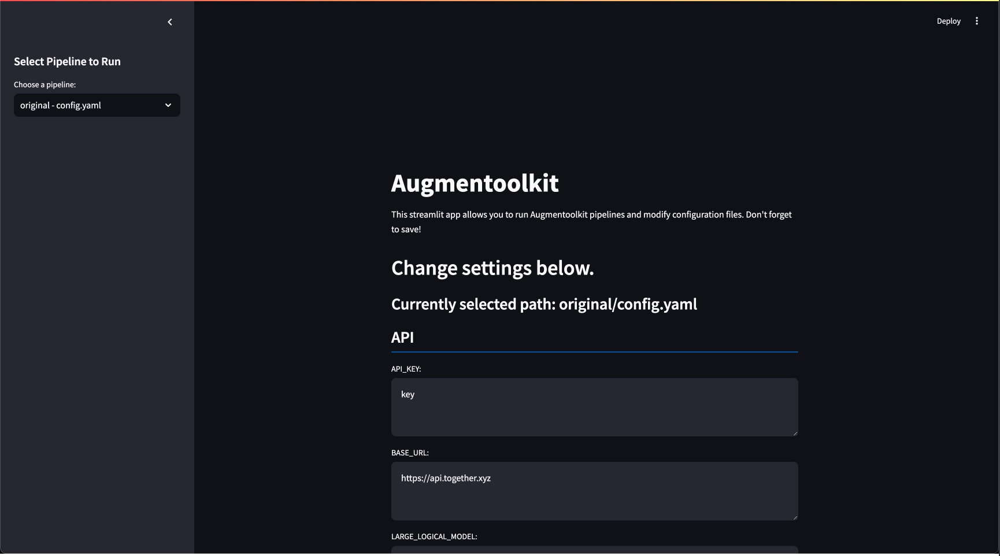
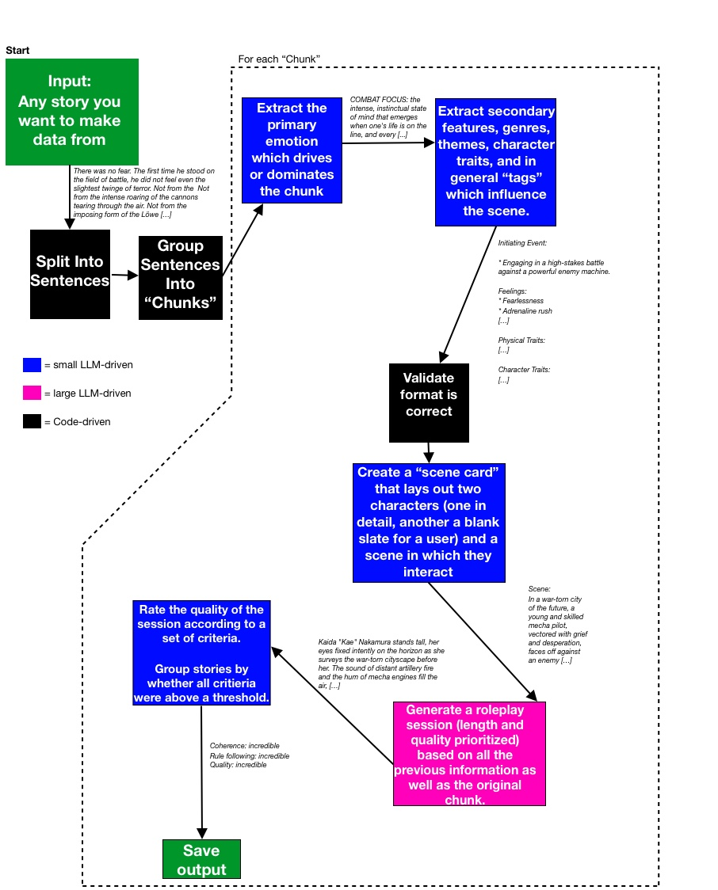
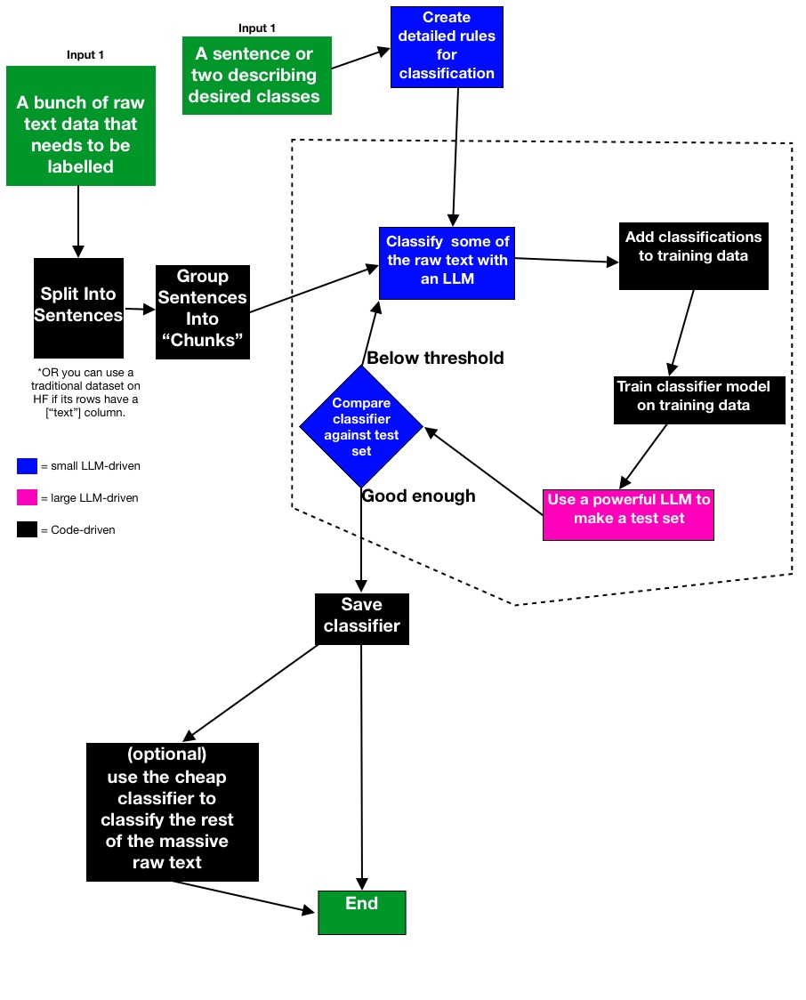

Note Sep 27 20:36 -- a breaking bug in conversation generation has been fixed
# Augmentoolkit — infinite domain-specific instruct data
Your custom LLMs need custom data. [Augmentoolkit creates quality data quickly, cheaply, and painlessly.](#benefits)

Now you can [turn any raw text](#quickstart) into a high-quality custom dataset for training new LLMs (or classifiers), using open-source AI. Make data gathering a painless step of the model creation process. Augmentoolkit is the easy-to-use, customizable, open-source, and cost-effective data generation solution. No OpenAI needed.

Being extensible, new pipelines can be added to Augmentoolkit incredibly easily, and there are already three of them: the original QA generation pipeline, the classifier creator, and a pipeline for generating creative writing data based on inputted fictional stories.

Augmentoolkit is an AI-powered tool that lets you create domain-specific data, using open-source AI.


 
If you like the project, please consider starring it!


---

### RECENT FEATURES UPDATE — SEPTEMBER 12th 2024
In addition to a complete refactor that makes adding and using many different pipelines easy, [Augmentoolkit can now make high-quality RP data based on the themes and narratives of any story imaginable](#rptoolkit).* Basically:

1. LLM extracts the primary theme and various genre tags from a chunk of a story
2. LLM generates a character card and plan for the overall story
3. LLM uses a truly massive prompt — 22 thousand tokens long — to make a very long-context story
4. Story is rated according to a set of criteria for non-repetitiveness and writing quality.
5. Story is saved.

I used this pipeline to train make a medium-sized RP dataset to demonstrate the process* **It's got about 1000 stories and 1,169,884 trainable tokens** — [you can check it out here](https://huggingface.co/datasets/Heralax/RPToolkit-demo-dataset)!

*So all you need to get quality RP data is now some stories you like and a button press. Finally you can make AI inspired by the same literature, games, or other fictional media you love — for instance, feed in Lord of the Rings, you get out high fantasy RP sessions. That is the intended utility of this new pipeline.*

This pipeline can get a bit pricey if using an API, I recommend using local generation or renting compute on a service like Runpod. The really expensive step is story generation; it might make sense to take a hybrid approach and use an API for all non-storygen steps, but use a powerful local model on rented compute for story generation. This will allow for a good balance of speed and cost.

To get started, point `super_config.yaml` at any of the RPToolkit preset configs. You can check out detailed instructions and guidance in the [RPToolkit section of this README](#rptoolkit)

**OK, back to your regularly-scheduled README.**

---

Cite:
[](https://zenodo.org/doi/10.5281/zenodo.11525927)

### Benefits
**Augmentoolkit makes LLM data easy.**
- **Cheap:** Augmentoolkit pipelines use open-source LLMs, and so can be run on consumer hardware for hardly any cost, or cheaply via APIs like Together.ai.
- **Effortless:** Any Augmentoolkit pipeline can be run by putting some files in a folder, and then running a Python script. If that's too much, you can also use the graphical user interface. Previously-started runs are continued automatically, so you don't need to worry about interruptions costing you time and/or money.
- **Fast:** when using APIs, you can generate millions of trainable tokens in under an hour. Fully async code lets you get results quickly.
- **Anti-hallucination, quality data:** Augmentoolkit pipelines have extensive validation — whether by checking all important outputs for hallucinations and failures, or harshly rating the final outputs, care is taken to ensure high quality. Delicately-crafted few-shot examples force the open-source models used to be consistent and smart.

We've also done our best to **facilitate the step after you generate your data -- training your LLM:**
- **Train an AI for the cost of a dinner:** with the provided training configs, you can perform the equivalent of a full finetune of an AI,  on your own data, for a tiny sum of money. VRAM usage varies by model, of course -- and this can work in your favor.
- **Create your LLM in less than a day:** with reasonable dataset sizes and the provided training configs, LLM training can be done before the day is out. Iterate quickly and cheaply.
- **When you use the same recipe, you get the same bread:** Augmentoolkit datasets have been used successfully for professional consulting projects. Video documentation is linked in this README that shows exactly how to use this tool to do the same. The code, settings, and prompts you need is all here.
- **Train AI with confidence, *especially* if it's your first time:** between the extensive video docs, in-depth README, and GitHub issues support, you can be confident you'll get a good LLM out of this.

Finally, **using the model you create should be easy and valuable:**
- **AI that understands your facts:** For the professionals and the passionate: training an LLM with Augmentoolkit's QA pipeline creates an assistant that understands the big picture of the data you're training on. If RAG is like giving an LLM an open-book test on a textbook it hasn't read before, then training on Augmentoolkit data gives it some time to study before the test as well. This pipeline has been battle-tested in consulting projects across different industries.
- **AI inspired by your favorite fiction:** For the creatives and entertainers: using RPToolkit, you can create detailed and varied multi-turn roleplaying data with the themes of any story you can think of. If you're creating custom AI for creative or entertainment purposes, you can now specialize it in any genre you want. Want a depressing and dark specialist in mecha stories? Feed in some stories and you can get a ton of data for that. How about an AI writer of wholesome slice of life? You can get data for that too. Create as broad or as narrow of a writing AI as you want from whatever inspiration you can find.
- **Make sense of massive data without using human annotators:** For the heavy-duty ML professionals: if you have a large dataset with tons of unlabelled text (like the Enron emails dataset, IMDB, or fineweb, etc.) you can now write a sentence or two that describes two classes which exist in that data. Augmentoolkit's classifier creator pipeline will then use an LLM to make a full classification dataset, based on a subset of the input data and your specified classes; it'll then train a classifier and evaluate it and take more data and retrain, in a loop, until validation loss is below a specified threshold. Classifiers trained using this pipeline seem to achieve similar performance to classifiers trained on human-labelled data.

*Clarification: Augmentoolkit, the project, has multiple pipelines: the original pipeline (QA), RPtoolkit (rich multiturn roleplaying data), and the classifier creator. If it is said that "Augmentoolkit can make [some kind of data] then I mean that one of Augmentoolkit's pipelines can do so.*

## Demo video & Video Tutorials (EXTENSIVE LIBRARY):
[3-Minute Demo Video Here](https://www.youtube.com/watch?v=m32fM8S_DeY&ab_channel=Heralax)

[Quickstart Guide](https://youtu.be/YWPmike953I)

[Project Overview (for Intuition and understanding)](https://youtu.be/NADjR17rhls)

[Local Dataset Generation Tutorial](https://youtu.be/_jA4gRFvZ9o)

[Renting Compute For Datagen (Aphrodite engine)](https://youtu.be/LWK8xg0D4OE)

[Training a Model on Augmentoolkit Data](https://youtu.be/dby8y4hkJQU)
**IMPORTANT NOTE: if you're creating your Runpod account for the first time in the above video, I would appreciate it if you used this Runpod referral link [https://runpod.io?ref=tjhovswf](https://runpod.io?ref=tjhovswf) to support Augmentoolkit's creation and open-sourcing of additional datasets.**

[Augmentoolkit Original Introduction/Hype Video](https://youtu.be/CjNQD_PxWjA)

[RPToolkit Introduction/Hype Video](https://youtu.be/gQr88EC_Dfc)

[Classifier Creator Demo (set to a Chopin piece no less)](https://www.youtube.com/watch?v=pkJbIUv7lLs)

## Table of Contents:
1. [Quickstart](#quickstart)
    - [Terminal](#terminal)
    - [Web UI](#web-ui)
2. [Vision (Introduction)](#vision)
3. [Usage](#usage)
    - [Relevant Video](#relevant-video)
    - [Installation](#installation)
    - [Basics of running Augmentoolkit](#basics-of-running-augmentoolkit)
    - [`super_config.yaml` explanation and usage](#super-config)
4. [Each Pipeline In-Depth](#each-pipeline-in-depth)
    - [QA Generation](#qa-generation)
        - [Overview](#qa-overview)
        - [Config step-by-step](#qa-config-step-by-step)
        - [Visual Explanation of Steps](#qa-visual-explanation-of-steps)
        - [Quirks and Tips](#qa-quirks-and-tips)
    - [RPToolkit](#rptoolkit)
        - [Overview](#rptoolkit-overview-and-quickstart)
        - [Config step-by-step](#rptoolkit-config-step-by-step)
        - [Visual Explanation of Steps](#rptoolkit-visual-explanation-of-steps)
        - [Quirks and Tips](#rptoolkit-quirks-and-tips)
    - [Classifier Creator](#classifier-creator)
        - [Overview](#classifier-overview-and-quickstart)
        - [Config step-by-step](#classifier-config-step-by-step)
        - [Visual Explanation of Steps](#classifier-visual-explanation-of-steps)
        - [Quirks and Tips](#classifier-quirks-and-tips) 
5. [Customization](#customization) 
    - [Abstractions](#abstractions)
        - [Pipeline Step](#pipeline-step)
        - [Generation Step](#generation-step)
        - [Engine Wrapper](#engine-wrapper)
    - [Creating a new pipeline](#creating-a-new-pipeline)
      - [Naming conventions and folder structure](#naming-conventions-and-folder-structure)
      - [Code must-dos](#code-must-dos)
      - [Config.yaml must-dos](#config-structure)
      - [If you make a new pipeline](if-you-make-a-new-pipeline)
7. [Training a model](#training-a-model)
8. [Roadmap](#roadmap)
9. [Contributing](#contributing)
10. [Community](#community)
11. [Self Promotion (Read if you're a Business!)](#for-businesses)
12. [Think this is cool? Connect with me elsewhere!](#think-this-is-cool-connect-with-me-elsewhere)

## Quickstart

The quickstart instructions are for the QA pipeline. The process for using other pipelines, or other config files within the QA pipeline, is much the same; just change the folder path and config path in `super_config.yaml` as well.

### Terminal

After installing the dependencies:

- Get the repo onto a computer with an internet connection
- Install its dependencies (`pip install -r requirements.txt`) (Augmentoolkit is tested mainly on Python 3.11, but it should be pretty flexible)
- Open `config.yaml`
- Paste your API key, favorite model name, and the endpoint URL of your preferred AI service, into the relevant fields inside `config.yaml`. Recommendation: [Together.ai with Llama 3.1 8b works really nicely both as a LARGE_LOGICAL_MODEL and as the LOGICAL_MODEL](meta-llama/Meta-Llama-3.1-8B-Instruct-Turbo).
- Open this project's folder in a command line and type `python run_augmentoolkit.py` and hit enter (fires off the script version).

There's also a quickstart [video](https://youtu.be/YWPmike953I) that you can follow along with! **The default provider has been changed to DeepInfra, you'll need to get a key from them or you'll have to change the base URL to together.**

**If you want to use PDFs,** you will have to install tesseract, which has its own installation instructions: https://github.com/tesseract-ocr/tesseract
However the project should work fine without it if you just want to use `.txt`.

### Web UI

1. Install the dependencies (`pip install -r requirements.txt`)
2. Run `python streamlit_app.py`
3. In the browser tab that this command opens, add your API key for whatever cloud AI provider you like the most, or a local AI server. Change the base URL as appropriate, too.
4. Save your changes.
5. Hit the run pipeline button at the bottom of the panel.



## Vision

**Dataset creation has long been the most painful, and most important, step of the finetune-creation process.** Most people have to resort to either A) burning an obscene number of OpenAI API credits, *after* spending a bunch of time making some hacked-together script for their needs, or B) spending hundreds, if not thousands, of hours accumulating a hybrid dataset based off of your own conversations with bots. The OpenAI approach is based on a paid service (whose TOS you're violating) that can ban you at any second, whose writing style you probably hate, which is getting worse every month, and whose synthetic data critically lacks variety. Handwriting the examples is far too slow to iterate on, and does not scale at all, meaning you're missing out on huge potential performance increases that come with more data. If you're a company and you pay people to create examples in bulk, then it's possibly pricier than even OpenAI — also not scalable at all. And moreover, if we're literally creating machines that can write, why do we spend most of our time writing?

**Augmentoolkit** is meant to make high-quality data generation easy, fast, shareable, configurable, and for everyone. **Some of the greatest joy in LLM creation is making an AI for an area you're passionate about; whether this passion is for fiction or a factual domain, Augmentoolkit lets you create the custom data you need to make your dream AI model real.**

Having been rebuilt from the ground up to be extensible and configurable, Augmentoolkit is now the best place for any open data generation pipeline to exist on. Adding a new pipeline being as simple as copying a folder. Pipelines themselves can have their prompts switched out in a completely modular manner. Settings are simple to change, too. Finally, a minimalistic but useful set of abstractions make building resumable data generation pipelines easy as pie. Augmentoolkit is more than just a pipeline — it's more than just three pipelines, even! It's THE place for model creators to build their datasets, whether they're professionals or hobbyists. And it's an evolving open-source project with more added every month.

Augmentoolkit allows any enthusiast, regardless of computer strength, to contribute to the advancement of AI by generating swathes of data for cheap or by designing and contributing a pipeline for a new and important task. The Augmentoolkit project strives to expand the possibilities of what finetunes can be built, by making data gathering as easy as running a script. Whether you're finetuning a company chatbot to understand your business's information, are creating an [AI ambassador for your community that can explain your mission and goals](https://finance.yahoo.com/news/introducing-llama-3-verusgpt-open-183700217.html?guccounter=1), or are doing something else entirely, **Augmentoolkit exists to make your data problems a bit less problematic.**

We're going to make dataset creation the most enjoyable, powerful, and flexible part of creating a new LLM.

Right now you can:

- **Create multi-turn conversational QA data from books, documents, or any other text-based source of information.**
- **Create rich and varied roleplay data, using the themes and defining features of stories or other fiction as inspiration.**
- **Train a text classifier using just unsupervised, unlabelled text as an input. For next to no cost. Achieves results very close to classifiers trained on human-labelled data.**
- **Chain and compose executions of these pipelines to produce truly vast and varied datasets, and stay organized with the new redesigned workflow.**
- **Modify and tweak the prompts or settings to make something perfect for your specific use case — without changing code.**

Whether you want to train an LLM on your company's knowledge base, create a roleplayer specializing in your favorite genre, or create an AI expert on 18th century military strategy, Augmentoolkit removes 'not enough data' as an obstacle.

I can't wait to see what you'll build.

## Usage

### Relevant video
Assuming that you have installed things already, using the quickstart, an overview of the important parts of the project can be found [here](https://youtu.be/NADjR17rhls). Otherwise, follow the instructions below to install and get an understanding of the overall shape of the project.

### Installation
First, get the repository onto your computer:
```
git clone https://github.com/e-p-armstrong/augmentoolkit.git
```

Then, install the project's dependencies.
```
pip install -r requirements.txt
```
You may get some messages saying that torchvision and torchaudio require older versions of Pytorch. This should be safely ignorable.

NOTE it is likely more cost-effective for large scale dataset generation to rent GPUs for a couple bucks/hr on a service like Vast.ai or Runpod, than it is to use APIs like Together.ai. However, APIs are faster and require little setup. So the currently advised process is: experiment with APIs, and generate for production with rented compute.

There are two video guides on local dataset generation with Augmentoolkit, [one for running it on your actual computer](https://youtu.be/_jA4gRFvZ9o), and [another for renting computers with powerful GPUs and using those to cost effectively generate data](https://youtu.be/LWK8xg0D4OE).

**A note for when you start using Augmentoolkit multiple times: all of Augmentoolkit's pipelines, to some extent, resume previously-started runs if the output folder is not empty. Rename or move it elsewhere if you are not trying to continue interrupted dataset generation, or change the output folder path in the config you're using.**

### Basics of running Augmentoolkit

The main script of the project is `run_augmentoolkit.py`. This script uses `super_config.yaml` to decide which pipelines to execute, in what order, with which settings (config files). A pipeline is a folder that contains the following files: a `processing.py`, a `steps.py`, an `__init__.py()`, and at least one `.yaml` file with `config` in the name. Details of what settings should exist in each project's `config.yaml` can be found in the section of this README devoted to that pipeline.

To change settings (like the API provider, chunk size, whether to skip certain steps, or which prompts preset to use) of an individual pipeline, you change its config file (or add a new one) in its folder. To change which pipeline you run when you run `run_augmentoolkit.py` you change `super_config.yaml`.

### Super Config
*~~One config to rule them all~~*

The file `super_config.yaml` lets you choose which pipelines to run. It's a very simple and minimalistic file. Its contents might look like this, for instance:
```yaml
pipeline_order:
  - folder: "classifier_creator"
    config: "config.yaml"
  - folder: "original"
    config: "config_overrides/groq/groq-normal.yaml"
  - folder: "original"
    config: "config_overrides/groq/groq-negative.yaml"
```

Each `folder` field is a relative path (relative to the root folder of the project) to a valid pipeline folder (contains a `processing.py` and a `steps.py` etc. at top level). Each `config` field is a relative path (relative to the pipeline folder specified in `folder`) that points at a `.yaml` file that contains settings for that given pipeline. This setup means that one project can have many different config files, and the pipeline operator can switch between them as needed depending on the situation and requirements. This is a benefit for organization.

Pipelines are executed in the order they appear in the pipeline_order from top to bottom.

## Each Pipeline In-Depth

### QA Generation

#### QA Overview

The first pipeline to ever be added to Augmentoolkit, QA generation is focused on creating instruct tuning data for specific facts. This can give an LLM a broad understanding of the facts behind a subject. Especially when combined with RAG, this can produce a bot that is decent at answering factual questions on a specific domain — in other words, this is great for creating domain experts.

The QA pipeline also comes bundled with three prompt override suites by default. open-ended prompts (`original/prompt_overrides/prompts_override_open-ended_questions`) create long and detailed single questions, while negative prompts (`original/prompt_overrides/prompts_override_negative_questions`) help defend against hallucination. 

#### QA Config, Step-by-Step

You can easily customize Augmentoolkit's original pipeline by changing the settings in `config.yaml` or one of the other configs in that pipeline. Augmentoolkit's QA pipeline, specifically, has a wide variety of prebuilt configs for a number of different API providers and local AI servers (Ollama, llama.cpp, Aphrodite Engine, etc.). Let's walk through each field in the YAML file so that you can understand how to change it to suit your needs:

**First up, we have the API section:**
```
API:
  API_KEY: your key here
  BASE_URL: https://api.together.xyz
  LARGE_LOGICAL_MODEL: meta-llama/Llama-3-70b-chat-hf
  LOGICAL_MODEL: meta-llama/Llama-3-70b-chat-hf
```

Field-by-field:
- `API_KEY` this is where you put the API key for your favorite API provider. If you're running a local server, put a dummy value in here so that the formatting of the request does not break.
- `BASE_URL` this is the base URL for the API provider you are using. Some possible values:
    - http://localhost:2242/v1 <- aphrodite (local)
    - http://localhost:8080/ <- llama.cpp
    - http://localhost:11434/v1 <- Ollama
    - https://api.together.xyz <- together.ai, which offers quality open-source models for cheap prices. Their service has reliability issues sometimes, however.
    - https://api.groq.com/openai/v1 <- Groq. They offer their API for free but have low rate limits.
    - https://api.openai.com/v1/ # <- OpenAI
    - anything else that accepts OAI-style requests, so basically any API out there (openrouter, fireworks, etc...)
    - **You can see a lot of potential BASE_URLs in the `config_overrides/` folder in the `original` pipeline.**
- `LARGE_LOGICAL_MODEL` the name of the large model you want to use. This is the model that will be used for the final generation step. This should be a decently-strong model. The model used to power Augmentoolkit is separated into two models to save costs on easier steps early on in the pipeline. (This field is likely irrelevant if you're using a local server.)
- `LOGICAL_MODEL` the name of the model you want to use for the first few generation steps. It can be a decently cheap model, but stronger models will still result in better final outputs.

**Following this, we have the `HUGGINGFACE` section:**
```
HUGGINGFACE:
  HUB_PATH: yourusername/your-path-here
  PRIVATE: False
  PUSH_TO_HUB: False
```

This section lets you automatically push your generated dataset to the HuggingFace Hub once it is finished generating. There is a bit of configuration:
- `PUSH_TO_HUB` is a boolean that determines whether the dataset will be pushed to the HuggingFace Hub once it is finished generating. If it's `True`, the dataset will be pushed. `False` essentially disables this entire section.
- `HUB_PATH` is the HuggingFace path that Augmentoolkit will try to push your dataset to once it is finished generating. This is a string that looks like `yourusername/your-path-here`.
- `PRIVATE` is a boolean that determines whether the dataset will be private or public on the HuggingFace Hub. If it's `True`, the dataset will be private.

Next up, we have the `PATH` section: 

```
PATH:
  INPUT: "./raw_text_input_vision_paper"
  OUTPUT: "./output"
  DEFAULT_PROMPTS: "./prompts"
  PROMPTS: ./prompts_vision_paper
```

Field-by-field:
- `INPUT` the relative path to the folder where the raw text input is stored. This is the folder that contains the text files that you want to use as input to the pipeline. The files can be .txt and/or .md (.pdf and .docx coming soon). They can be nested inside folders if you want, so very little cleanup work is required when working with a new source of data that you might have lying around.
- `OUTPUT` the relative path to the folder where the output of the pipeline will be stored. This is the folder that will contain the dataset files (.jsonl) that are generated by the pipeline, as well as a complementary continued-pretraining dataset. Intermediate generations (useful for debugging or interpretability) are also here.
- `DEFAULT_PROMPTS` the relative path to the folder where the core prompts of Augmentoolkit are stored. This is the folder that contains the prompt files that are used throughout the pipeline. `DEFAULT_PROMPTS` is the fallback folder that Augmentoolkit will use if it can't find a prompt in the `PROMPTS` folder.
- `PROMPTS` the relative path to the folder where the prompts for the current run of Augmentoolkit are stored. Compared to `DEFAULT_PROMPTS`, `PROMPTS` is essentially an override: if a prompt is found in the `PROMPTS` folder, it will be used instead of the prompt of the same name in the `DEFAULT_PROMPTS` folder. This allows you to create different prompts for new kinds of input data that the original prompts may not be well-suited for. See `prompts_code_override` and `prompts_vision_paper_override` for examples of how this can be used.

**PHASE** is left to the end of this step-by-step since it's a bit nuanced.

**Briefly, we have the `SKIP` section:**
```
SKIP:
  ANSWER_RELEVANCY_CHECK: False
  FILTER_CHUNKS: False
  QUESTION_CHECK: False
  CONVERSATION_GENERATION: False
  REPAIR_QA_TUPLES: True
```

Very simply, this section lets you skip certain parts of the QA pipeline. All of these are currently validation steps: they will just act as if everything came out as True (passed). This is useful for certain types of data — for instance, if the filter_chunks step keeps deciding that much of your data is "not suitable for questions" even if it is just unconventional, then you can solve this problem by skipping the step. This is a tradeoff, however: skipping these steps can lead to lower-quality data, especially under normal circumstances.

**IMPORTANT** If you want to use the "negative" prompt overrides, **you have to turn skip answer relevancy check on!!!**

**Next, we have the `SYSTEM` section:**
```
SYSTEM:
  CHUNK_SIZE: 1900
  USE_FILENAMES: False
  COMPLETION_MODE: false
  CONCURRENCY_LIMIT: 60
  DOUBLE_CHECK_COUNTER: 1
  DO_NOT_USE_SYSTEM_PROMPTS: True
  FINAL_ASSISTANT_PROMPT_NO_RAG: |
   You are a helpful, friendly AI assistant.
  FINAL_ASSISTANT_PROMPT_RAG: |
   You are a helpful, friendly AI assistant.

   Context information is below:
   
   ----------------------
   {data}
  MODE: api
  STOP: true
  SUBSET_SIZE: 10
  USE_SUBSET: true
```

Field-by-field:
- `CHUNK_SIZE` is the maximum number of characters to use in a "chunk" of text that will be fed through the pipeline. A chunk is what questions are generated from — it's kinda the core building block of QA datasets built by Augmentoolkit.
- `USE_FILENAMES` determines whether the AI is allowed to see the name of the file from which each chunk of text/information was taken, when it's generating questions. If this is on, it means that questions may often have the format "What is X, according to file?" This can be useful if your files are books — so you might get "How do you sabotage a car, according to Simple Sabotage by the OSS?" if it's on. Compare this to when it's off — in which case the question might simply be "How do you sabotage a car?" This is good to have if you want the bot to have some meta-knowledge, but should usually be left off. If you want the AI to know the authors behind files, then format the names as `textname, by author name`. The comma is important.
- `COMPLETION_MODE` is a boolean that determines whether prompts are sent to the provider in chat mode (default, what happens when it's set to `false`) or completion mode (what happens when it's set to `true`). Completion mode can produce higher-quality responses with some models, but many providers don't support it.
- `CONCURRENCY_LIMIT` is an integer; it's the maximum number of concurrent requests that can be made to the provider. This is useful for controlling costs and preventing rate-limiting.
- `DOUBLE_CHECK_COUNTER` is an integer; it's the number of times that the pipeline will double-check the questions it produces. For each QA pair, the majority vote goes: if it's positive, the question/answer pair is kept, if it's negative, the QA pair is tossed. Ties are tossed. This is a tradeoff parameter: higher means more quality but far higher cost. 3 is a good starting point.
- `DO_NOT_USE_SYSTEM_PROMPTS` is a boolean that determines whether, at the very end of the pipeline, the generated data includes system prompts or not. This does not affect the running of the pipeline; rather, it only affects the saving of the dataset at the end. Sometimes using no system prompt can help an LLM learn the facts of a dataset to a greater degree, and produces a more stable LLM which is less sensitive to needing a very specific system prompt. Turning this on means that FINAL_ASSISTANT_PROMPT_NO_RAG will not be used.
- `FINAL_ASSISTANT_PROMPT_NO_RAG` is a setting used to control the form of the dataset produced at the very end. What you write here will be the system prompt of the AI in the portion of the dataset that does NOT have RAG supporting the outputs. This is where we get the LLM to rely on the knowledge we teach it.
- `FINAL_ASSISTANT_PROMPT_RAG` is like its NO_RAG cousin, except it's used in the portion of the dataset that DOES have RAG supporting the outputs. This is where we get the LLM to combine understanding with retrieved information to produce an answer. A key difference: wherever `{data}` appears, it will be replaced with the RAG context for each sample in the dataset. So place it where you want the context to appear in the prompt.
- `MODE` is the mode that the pipeline will run in. `api` is the default mode, and is used for running the pipeline with APIs supporting the OpenAI standard. `cohere` is also supported, and is used for running the pipeline with the Cohere API (BASE_URL does nothing in `cohere` mode).
- `STOP` is a boolean that determines whether the pipeline uses stop tokens or not. You should always have this set to `true` unless you're using an API that arbitrarily limits the number of stop tokens you can use, like OpenAI.
- `SUBSET_SIZE` controls the number of chunks fed through the pipeline if USE_SUBSET is on. This is useful for debugging and testing quickly and cheaply — only the first `SUBSET_SIZE` chunks will be processed.
- `USE_SUBSET` is a boolean that determines whether the pipeline uses a subset of the input data.

**Finally, PHASE:**

One constraint of local generation is that you can only run one model at once. Augmentoolkit typically uses two different models: a small one for bulk work, and a large smart one for tough tasks. To still use small, efficient models for bulk work and large ones for the difficult steps, we have to run a pipeline with one model, stop at the point where the model we're using changes, run it again with a different model, and so on until the whole thing is done. `PHASE` exists to make this process easier.

The process is: turn `WORK_IN_PHASES` to True, and set `PHASE_INDEX` according to how far along your dataset generation run you are. For QA generation, phase index 0 = filtering out chunks with no relevant context, and uses small models; index 1 = question generation, uses large models; index 2 = question validation, answer relevancy validation, and answer accuracy validation, uses small models; index 3 = context revision and conversation generation, the final phase, uses large models.

Start up your local openai-compatible LLM server, with a smaller model. Set the config to this:

```
PHASE:
  WORK_IN_PHASES: True
  PHASE_INDEX: 0
```

get all your other settings in place (input texts, base_url, etc.), and run `run_augmentoolkit.py`. When that finishes, change the config to:

```
PHASE:
  WORK_IN_PHASES: True
  PHASE_INDEX: 1
```

and restart your local LLM server to use a larger and more powerful LLM. Then run `run_augmentoolkit.py` again — it will pick up where you left off, thanks to Augmentoolkit's auto-resume feature. When that step completes, set the config to

```
PHASE:
  WORK_IN_PHASES: True
  PHASE_INDEX: 2
```

and have your local LLM server use a small model. Finally, once that is done, go ahead and run phase 3 with a large model:

```
PHASE:
  WORK_IN_PHASES: True
  PHASE_INDEX: 3
```

This process replaces the more-cumbersome approach of having two separate files for local inference. Now, you manage it from the config.
If you want to "set it and forget it" with your datagen run, you can just eat the longer generation time of using a more powerful model for everything, it won't hurt you. Unless you're using rented compute, in which case the slower speeds will mean more hours of renting, and more cost, which might hurt a bit.

**To speed up generation and get cost efficiency, it may be best to rent compute using Runpod.io or a similar GPU renting service (recommend either 2x H100s, or 8x A40s). For large-scale dataset generation tasks this will likely be cheaper than using an API, and it doesn't suffer from quite the same painful generation speed problems that consumer hardware can face sometimes.**

If `WORK_IN_PHASES` is off, the whole pipeline will execute when you run the script.

Happy dataset generation! Enjoy making awesome domain experts, now that data is finally an easy part of the process.

#### QA Visual Explanation of Steps

Here is a flowchart detailing how a typical run of Augmentoolkit's QA pipeline may proceed. The source text can be anything with information you can ask questions about.


#### QA What to do with the outputs

The important files to look out for in your `OUTPUT` folder are `simplified_data_no_rag.jsonl`, `simplified_data_rag.jsonl`, and `pretraining.json`. These are what you will most commonly use for training. The other top-level files are there incase you want more information, such as the chunk and name of the file that each conversation was generated from. But for training, you will want `simplified_data_no_rag.jsonl`, `simplified_data_rag.jsonl`, and `pretraining.json`. All are already formatted for use with the [Axolotl](https://github.com/OpenAccess-AI-Collective/axolotl) open-source training library. All you need to do is use these datasets like how the provided configs in `_model_training_configs/` are used.

The format of the conversational files is called "ShareGPT", and is a common format across many datasets. `pretraining.json` however is formatted as pretraining data. To bake factual information into an LLM, it is recommended you use a full finetune or (cheaper) GaLore tuning, combined with continued pretraining on the source text + the instruct data that Augmentoolkit generates. If you want a more in-depth example, check out the provided configs, or the second video of the [Video Documentation](https://youtu.be/3YpO-n1U8qs).

In a recent update, Augmentoolkit gained the functionality where you get data from the generation of questions, filtering of input chunks, and conversation generation, as well. These can be identified by being `.jsonl` files with `_DATAGEN_OUTPUT` in their filenames. You'll understand what exactly they are when you look at one.

They're in ShareGPT format for easy training, and can be used to bulk up a training run by acting as yet more diverse data on the given subject. They can also be used to make LLMs that are experts in running as part of Augmentoolkit specifically — train a model on enough of these, and you will get a powerful tool for local inference.

#### QA Quirks and Tips

- **The `FILTER_CHUNKS` step can be a bit finnicky.** It's designed to filter out chunks that don't have any relevant context in them, but sometimes it can be a bit overzealous. If you find that it's filtering out too much, you can turn it off in the config.
- **The QA pipeline works with very messy text.** No great cleaning or filtering of formatting or other issues is required before the text reaches the pipeline. Since it makes questions and answers based off of the text, rather than directly using the text verbatim, it can handle a lot of noise.
- **The validation of questions and answers takes the majority of the time in a given run. If you're in a hurry, consider skipping a step or two.**


### RPToolkit

RPToolkit, as a pipeline, is contained within the larger Augmentoolkit project (which has a few other pipelines for other uses). [Click here](#augmentoolkit--infinite-domain-specific-instruct-data) to go to the top of the README. [Click here](#table-of-contents) to see the table of contents.

#### RPToolkit Overview and Quickstart

RPToolkit is the answer to people who have always wanted to train AI models on their favorite genre or stories. This pipeline creates varied, rich, detailed, multi-turn roleplaying data based on the themes, genre, and emotional content of input stories. You can configure the kind of data you generate through the settings or, better still, by changing the input data you supply to the pipeline.

The writing quality and length of the final data in this pipeline is enhanced through a painstakingly-crafted 22-thousand-token prompt.

Here's how to run this pipeline (a quickstart):

`pip install -r requirements.txt`

Change `super_config.yaml` to be:
```yaml
pipeline_order:
  - folder: "rptoolkit"
    config: "config.yaml"
```

Add your API key for `fireworks.ai` to `rptoolkit/config.yaml`. If you want to use a different provider, change the BASE_URL to that provider's OpenAI-compatible API.

Then run `python run_augmentoolkit.py`.

#### RPToolkit Config Step-by-Step

**First up, we have the API section. RPToolkit's API section is basically the same as the QA pipeline, except allowing finer control.**
```
API:
  API_KEY_A: key
  API_KEY_B: key2
  BASE_URL_A: https://api.together.xyz
  BASE_URL_B: https://api.fireworks.ai/inference/v1
  LOGICAL_MODEL_A: meta-llama/Meta-Llama-3.1-70B-Instruct-Turbo
  LOGICAL_MODEL_B: accounts/fireworks/models/llama-v3p1-405b-instruct
```

Field-by-field:
- `API_KEY_A` this is where you put the API key the API provider you are using for the smaller model in this pipeline. If you're running a local server, put a dummy value in here so that the formatting of the request does not break.
- `API_KEY_B` the same as API_KEY_A except for the bigger model of the two. A good way to remember which is which: "B" stands for "Bigger".
- `BASE_URL` this is the base URL for the API provider you are using. Some possible values:
    - http://localhost:2242/v1 <- aphrodite (local)
    - http://localhost:8080/ <- llama.cpp
    - http://localhost:11434/v1 <- Ollama
    - https://api.together.xyz <- together.ai, which offers quality open-source models for cheap prices. Their service has reliability issues sometimes, however.
    - https://api.groq.com/openai/v1 <- Groq. They offer their API for free but have low rate limits.
    - https://api.openai.com/v1/ # <- OpenAI
    - anything else that accepts OAI-style requests, so basically any API out there (openrouter, fireworks, etc...)
    - **You can see a lot of potential BASE_URLs in the `config_overrides/` folder in the `original` pipeline.**
    - Local model recommendation: turboderp/Mistral-Large-Instruct-2407-123B-exl2 by MistralAI (quantized by Turboderp)
- `LOGICAL_MODEL_A` the name of the first model you want to use. This is the model that will be used for emotion extraction, feature extraction, and other relatively easier steps. It should still be pretty smart, however -- in the 70b parameter range, if you can afford it. RPTK is a difficult pipeline for models to clear.
- `LOGICAL_MODEL_B` the name of the model you want to use for the story generation step. It needs to be a powerhouse with high context (at least 30k or more) and good writing. A good open model to use if you're running this locally: `turboderp/Mistral-Large-Instruct-2407-123B-exl2`

**Next up, we have the PATH field. This is exactly the same as that of the QA pipeline.**

```yaml
PATH:
  DEFAULT_PROMPTS: ./prompts
  INPUT: ./raw_txt_input
  OUTPUT: ./output
  PROMPTS: ./prompts
```

Field-by-field:
- `DEFAULT_PROMPTS` the relative path to the folder where the core prompts of RPToolkit are stored. This is the folder that contains the prompt files that are used throughout the pipeline. `DEFAULT_PROMPTS` is the fallback folder that RPToolkit will use if it can't find a prompt in the `PROMPTS` folder.
- `INPUT` the relative path to the folder where the raw text input is stored. This is the folder that contains the text files (likely containing stories or other fictional content) that you want to use as input to the pipeline. The files can be of a variety of formats, and some can be nested inside folders if you want, so very little cleanup work is required when working with a new source of data. *You don't really need to clean the stories up, and in fact you can use basically anything as input to RPToolkit as long as it vaguely has elements of a story. Game scripts, books, plays, movie scripts, you name it.*
- `OUTPUT` the relative path to the folder where the output of the pipeline will be stored. This is the folder that will contain the dataset files (.json) that are generated by the pipeline. Intermediate generations (useful for debugging or interpretability) are also here.
- `PROMPTS` the relative path to the folder where the prompts for the current run of RPToolkit are stored. Compared to `DEFAULT_PROMPTS`, `PROMPTS` is essentially an override: if a prompt is found in the `PROMPTS` folder, it will be used instead of the prompt of the same name in the `DEFAULT_PROMPTS` folder. This allows you to create different prompts for new kinds of input data that the original prompts may not be well-suited for. See `prompts_code_override` and `prompts_vision_paper_override` for examples of how this can be used.

**Following this, we have RPToolkit's PHASES step. This is also very similar to that of the QA pipeline.**

```yaml
PHASE:
  WORK_IN_PHASES: False
  PHASE_INDEX: 0
```

- `WORK_IN_PHASES`: turn this to True to only run up to a certain point in the pipeline. This is useful for local dataset generation, if you're being  very efficient about it. See the description of `PHASES` in the QA pipeline section for a more in-depth explanation of what this actually means. The only reason why I am not repeating it here, unlike my approach with all other settings is because the explanation of phases is honestly cumbersome.
- `PHASE_INDEX`: means the same as it does in the QA pipeline: PHASE_INDEX controls the step at which generation stops in RPToolkit. Of course, the phases themselves are different. Here's a list of all the phases:
    - Phase 0: Emotion generation, feature extraction, scene card generation. Uses a smaller model.
    - Phase 1: Story generation. Uses a behemoth model.
    - Phase 2: Story rating. Uses a smaller model.

**Finally, we have `SYSTEM`:**

```yaml
SYSTEM:
  COMPLETION_MODE: False
  CONCURRENCY_LIMIT: 3
  CHUNK_SIZE: 1500
  EMOTIONS: ['DOMINANCE', 'FEARLESSNESS', 'EMBARASSMENT', 'NIHILISM',
    'DETERMINATION', 'DESPERATION', 'LOSS', 'NOSTALGIA', 'ANTICIPATION',
    'TRUST', 'FEAR', 'DISORIENTATION', 'DEGRADATION']
  INCLUDE_CHUNK_IN_PROMPT: True
  MODE_A: api
  MODE_B: api
  PICK_EMOTION: True
  RP_PROMPT_END: ''
  RP_PROMPT_START: ''
  STOP: True
  SUBSET_SIZE: 3
  USE_MIN_P: False
  USE_SUBSET: True
```

Many of these settings are repeated from the QA pipeline, some are not. All will be covered here.

Field-by-field:
- `COMPLETION_MODE` is a boolean that determines whether prompts are sent to the provider in chat mode (default, what happens when it's set to `false`) or completion mode (what happens when it's set to `true`). **COMPLETION MODE IS PRESENTLY NOT SUPPORTED WITH RPTOOLKIT**.
- `CONCURRENCY_LIMIT` is an integer; it's the maximum number of concurrent requests that can be made to the provider. This is useful for controlling costs and preventing rate-limiting with APIs. With local generation using good servers like the Aphrodite Engine, you should set this much higher.
- `EMOTIONS` is a list of strings. This list is only used if `PICK_EMOTION` is false. This list of emotions is what the emotion generation AI will be forced to choose from when choosing a primary emotion to describe a given scene. Basically, this list turns the first prompt of the pipeline from "Come up with an emotion that best describes this scene" to "Choose from the list what emotion best describes the scene". This can be good if you want even finer control over what your data looks like, but be wary of inflexibility and possible incoherence if your chosen list of emotions is very small.
- `INCLUDE_CHUNK_IN_PROMPT` is a boolean. If it is on, then the chunk from the original story is shown to the AI when it is writing its own RP session to be used as the final data. This is useful for adding extra variety, spice, and coherence to the AI. It does, however, increase the cost of the pipeline by a bit as well as (slightly) risking the addition of plot points or proper nouns directly from the source text. Prompting has been added to mitigate this latter concern. I generally recommend leaving this on if you can, variety is really important for datasets.
- `MODE_A` is a string, and is something that really should be under the `API` section but whatever. It lets you choose what "mode" is used to make calls to whatever is running LOGICAL_MODEL_A. By this, I mean: the options are "api" (for openai-compatible APIs) and "cohere" (for Cohere AI's API). This exists to ensure that Augmentoolkit can support non-OpenAI compatible APIs. In RPToolkit specifically, the MODE for model A and B are separated for finer control.
- `MODE_B` is like MODE_A, but for model B. Perhaps this is not surprising.
- `PICK_EMOTION` is a boolean. If True, the model is not constrained to any list of emotions when choosing an emotion at the start of the pipeline. If False, the model is restricted to the `EMOTIONS` list.

`RP_PROMPT_END` and `RP_PROMPT_START` are for customizing the system prompts of the data that is produced at the end. The system prompts are formatted in this way in the code:
```python
rp_prompt_start + data_obj["scene_card"] + rp_prompt_end
```
So, `RP_PROMPT_START` is a string that is appended to the start of a scene card, and `RP_PROMPT_END` is appended to the end, to make up a "character card" in the training data. One of the great faults of RPToolkit is that its system prompts need to be far more varied, especially in formats. This is not yet in. In the meantime, you have control over the preambles and ends of the system prompts that are used during the saving of the data, after everything is generated. **You should probably leave these blank unless you have specific reason to do otherwise, as the defaults are mostly sensible.** Also, consider writing up a quick script to shuffle the order of information in the system prompts before training. I would accept such a contribution to the repo, in fact.

Moving onto the other fields:

- `STOP` is a boolean that determines whether the pipeline uses stop tokens or not. You should always have this set to `true` unless you're using an API that arbitrarily limits the number of stop tokens you can use, like OpenAI or Groq.
- `SUBSET_SIZE` controls the number of chunks fed through the pipeline if USE_SUBSET is on. This is useful for debugging and testing quickly and cheaply — only the first `SUBSET_SIZE` chunks will be processed.
- `USE_MIN_P` changes the sampling parameters of the story generation pipeline to include an experimental min_p setting. Very few API providers support this, and the setting itself is highly untested in RPToolkit, but min_p is traditionally exceptional for creative writing tasks. Notably, aphrodite supports min_p as it is used in Augmentoolkit. Consider enabling for potentially better performance with local dataset generation using Aphrodite.
- `USE_SUBSET` is a boolean that determines whether the pipeline uses a subset of the input data.
- `CHUNK_SIZE` is the maximum number of characters to use in a "chunk" of text that will be fed through the pipeline. A chunk is what an emotion and story features are extracted from, and eventually what the story is generated in reference to. Larger chunks will paradoxically cost less because you'll get fewer stories out of your dataset overall.


#### RPToolkit Visual Explanation of Steps



#### RPToolkit What To Do With Outputs

RPToolkit outputs its final, complete RP sessions to the `final_outputs` folder, inside the output folder. The files are mostly in ShareGPT for easy training, much like the QA pipeline.

`full_stories_list_complete_format.json` - this file contains every generation and every bit of information that was created for each chunk from the beginning of the pipeline, including intermediate steps. Think of it as a lossless extended format that lets you use this pipeline for other usecases than training if you have them. This file has absolutely every story, regardless of rating.
`full_stories_list_sharegpt.json` - this file contains every single story generated by RPToolkit in your generation run, regardless of rating. This means that everything from the lowest quality story to the highest quality story is there.
`good_and_above_stories_list_complete_format` - the same as `full_stories_list_complete_format.json` but filtered to only include stories with all categories ranked as "good" or above by the rating AI.
`good_and_above_stories_list_sharegpt` - Same as `full_stories_list_sharegpt.json` but filtered to only include stories with all categories ranked as "good" or above by the rating AI.
`incredible_stories_list_complete_format` - the same as `full_stories_list_complete_format.json` but filtered to only include stories with all categories ranked as "incredible" by the rating AI.
`incredible_stories_list_sharegpt` - Same as `full_stories_list_sharegpt.json` but filtered to only include stories with all categories ranked as "incredible" or above by the rating AI.

As for intermediate outputs: all intermediate outputs are in a folder named for the step (emotion_generation, feature_extraction, etc.). There are two subfolders in each of these folders, one containing `.yaml` files that are to be used for debugging or seeing what the AI has done; and `.json` files meant to be read by the pipeline in the event it is continuing a previous run.

#### RPToolkit Quirks and Tips

- **RPToolkit's pipeline steps are depth-first, rather than breadth-first.** This means that, rather than doing all the emotion extraction, then doing all the feature extraction, then doing all the scene card generation, etc., one step after the other, in RPToolkit some stories will generate fully before others have even completed their first step. This is by design as an experiment, and the idea is that it makes it easier to notice problems early on. However, it may give you the (mistaken) impression that progress is slow, because the progress bar won't move until the first story finishes generating fully or errors. So, patience is needed.
- **RPToolkit is very harsh.** In many places throughout the pipeline, if an LLM messes up and produces an output that fails to be parsed due to being malformed, RPToolkit will often end up tossing the whole thing. This is a rather extreme form of validation. You will have to be comfortable with seeing the occasional error message and traceback — everything's caught and handled, and it is often the case that even if some stories error, many others will get through and be great.
- **RPToolkit _can_ be used for NSFW, but it is not designed to be.** The current incarnation of RPToolkit is actually adapted from an NSFW pipeline I built way back in February, but I'm not sure how to release the NSFW pipeline without causing reputational damage to myself (the prompts are... cursed). Also, some people have expressed interest in buying datasets built by the NSFW pipeline, and it would be unfair to them to go and open it suddenly after we've both invested time in the discussions. In the meantime, if you represent an organization (or are just a committed hobbyist) and want to buy such data, give me a shout through any of the contact channels listed at the bottom of this README! Proceeds go to Augmentoolkit development, API credits, and food.

---

### Classifier Creator

#### Classifier Overview and Quickstart

The classifier creator lets you train a whole classification model in minutes. Generation can be done locally or via an API, while model training is done locally on the CPU (classifiers are just that easy to train!)

When do you want a classifier? Maybe you want to go through a dataset and classify data as "high-quality" or "low-quality" and train on only the high-quality stuff. Or, maybe you want to make some custom moderation for an application. Or, maybe you want to hunt through a large amount of text for specific kinds of information. Classifiers are old-school, but they're pretty cool and surprisingly useful nonetheless.

Here's how to run it (a quickstart).

`pip install -r requirements.txt`

Change `super_config.yaml` to be:
```yaml
pipeline_order:
  - folder: "classifier_creator"
    config: "config.yaml"
```

Then, download the IMDb dataset from Hugging Face:


And put it in the "input" folder pointed to by the `classifier_creator/config.yaml` file.

Add your API key and your favorite open-source AI API provider to that same file.

Then run: `python run_augmentoolkit.py`

Prompts for this new pipeline can be found in `prompts_classifier`.

**NOTE that the classifier creator can also take .json, .jsonl, and .parquet files as input, if they have a "text" column! This lets you use off-the-shelf datasets from Hugging Face, such as [Enron emails](https://huggingface.co/datasets/jacquelinehe/enron-emails) or [FineWeb](https://huggingface.co/datasets/HuggingFaceFW/fineweb)!**

**Key features at a glance:**
- The classifier creator makes a small classifier model that can be cheaply run over massive amounts of data, to group it into classes
- The classifier creator uses an LLM and a powerful few-shot prompt to teach a classifier any kind of classification task
- The classifier creator works until a certain accuracy threshold is reached
- Models trained with datasets made from the classifier creator appear to have very similar performance to models trained on human-labelled data.
  - The classifier creator can crank out classifiers for like, a dollar or two, however — if you're using APIs. It's even cheaper if it's local.
- The classifier creator takes `.txt`, `.md`, `.json`, `.jsonl`, and `.parquet` files. JSON, JSONL, and Parquet files must have a "text" column. This ensures compatibility with most natural text, as well as with many datasets on Hugging Face.
- Classifiers can be used to find good data in a large dataset, or to identify data with specific characteristics (if you need to read a lot of documents to find something, for instance), or for deployment as part of a larger AI-powered system (such as for moderation or analysis).

Don't hesitate to reach out if you have any questions about the new pipeline or Augmentoolkit! My contacts are at the bottom of this readme.

#### Classifier Config Step-by-Step

Most of the `config` settings are the same as Augmentoolkit's QA pipeline, but here are the points of difference:

- `LOGICAL_MODEL` In this pipeline, LOGICAL_MODEL handles the majority of the classification used to build the training data for your custom classifier. A model like Llama 3 8b works great.
- `LARGE_LOGICAL_MODEL` is used to 1) create the "rules" that the LLM classifier follows (based on your description of the task and what the classes mean). The large logical model is also used to do the classifications during the model evaluation phase, to make sure that the classifier is high quality and is not just learning the stupidity of a smaller model.
- `REQUIRED_ACCURACY: 0.90` under the `SYSTEM` heading, this field (less than 1) is the percentage of classifications that a trained classifier model must get "right" (compared to the LLM's classification) in order to pass and break of the continual improvement loop. Dpeending on your chosen classifier model and task, you may want to set this a bit lower — some of them can be pretty small.
- `CLASSIFICATION`
  - `CLASSES` is a list of strings that are the names of the classes the model will be classifying your text with. So, `["negative", "positive"]` for instance. These will appear as `0` and `1` respectively in the actual training data. This early version of the pipeline only supports binary classification (2 classes) BUT it has been built to make adding more classes relatively easy in the future, so expect that to arrive.
  - `DESC` is a string that describes what the classes mean. Something like `"Classify whether the text (a movie review) is positive or negative."` or `"Whether a text expresses positive or negative emotion."` or `Classify the text as metadata if it is clearly metadata, tables of contents, publication information, copyright info — anything not the actual meat of a book or article. Classify it as content if it is clearly content that actually means something. If it contains both, classify it as metadata.`
  - `PREDICT_ON_WHOLE_SET_AT_THE_END` is a boolean that decides whether or not to run the newly-trained classifier on the whole input text at the end. Turn this on if you are feeding Augmentoolkit the same data you want to eventually sort into two different classes..
`TRAINING:`
  - `MODEL_PATH` the path to the model on Hugging Face that you want to train your classifier on. This pipeline is tested on `distilbert-base-uncased`
  - `TRAIN_SET_SIZE` how many chunks to take for the first training run. A decent default value is 500.
  - `TRAIN_SET_INCREMENT` how many new chunks to add each time the classifier fails to match the LLM's performance
  - `TEST_SET_SIZE` How many test samples are taken when your new classifier's performance is being evaluated against the LLM. The number of times the classifier agrees with the LLM determines the accuracy score.
  - `TRUNCATION_TYPE` Some chunks are too big for the context length of your classifier model. So you can truncate. The options: head-tail (take first few tokens and a bunch of the ones at the end); end truncation (cut off excess stuff that does not fit into the chunk size at the end)
  - `MAX_ITERS` To avoid getting into an infinite money-spending loop, this is where you set an integer that marks the maximum number of datagen+training runs that will be performed. Note that the classifier creator is *much* cheaper than Augmentoolkit, so this can be set pretty high without fear. 5 is a decent starting point.

#### Classifier Visual Explanation of Steps



#### Classifier Quirks and Tips

- **The Classifier Creator is one of the few Augmentoolkit pipelines whose main output is not a dataset itself.** Instead, the main output is a model that can be used to classify text. The model is saved in the `output` folder. Of course, the pipeline also produces a dataset that can be used to train the model, and if PREDICT_ON_WHOLE_SET_AT_THE_END is on, it will also classify the entire input dataset using the new classifier. Even so, don't go trying to train an LLM on this stuff.
- **The Classifier Creator is really cheap compared to the other pipelines. It like, costs less than a dollar to run.** Training is even done on your computer's CPU.
- **It could be better.** This pipeline could benefit from some improvement. Specifically: it really needs multiclass classification, and automatic dataset balancing. Accepting contributions, here! Actually contributions are being accepted for all of Augmentoolkit, more stuff is better and it is very appreciated.
- **The classifier creator does actually have autoresume.** All training data is saved, and when resuming it's read -- if the amount of read data is less than the desired training set size, more is generated until the first training runcan be done. However **it does not use saved models again** — if you run the pipeline you are *going* to be training a model.

---

## Customization

I said before that Augmentoolkit was (re)built to be extensible, customizable, and modular. I was not kidding! While some other parts of this README have covered config settings and the overall 'shape' of the project, this part is dedicated to some information that should help you if/when you decide to build your own pipelines, or make contributions to the codebase.

**TLDR key points: the PipelineStep() is what you should use for most LLM calls, and by convention in Augmentoolkit, we pass information through a pipeline as a list of dicts and use the keys of the dict to format values into LLM prompts.**

### Abstractions

Let's first talk about the main abstractions that you'll see throughout Augmentoolkit. There are not too many of them, but they *are* useful, and you need to know how they work if you're going to work in this codebase.

#### From processing to the engine wrapper: how inputs travel

It's useful to know how inputs are passed along the code of Augmentoolkit, from start to finish, so that you can understand what the inputs to any of the given intermediate functions are.

So here's a description. **It's pretty long and recurses through much of the process, even getting decently low-level. It's only really recommended if you're going to be building your own pipeline to add onto Augmentoolkit. Also, if my explanations are bad, the locations for each important class are given so you can look at the code by itself.**

At the start of a pipeline, text is usually read from its input files as a string, and then broken into a list of dicts resembling `{"paragraph": "chunk contents would go here", "metadata": "the filename that the chunk belonged to originally"}` by some chunking algorithm. For the rest of the pipeline, the main store of information will be a list of dicts.

Typically the list of dicts is updated over the course of a pipeline by mapping an LLM-calling function over it asynchronously. The function will be passed a dict from the list, 

```python
tasks = [
        steps.generate_qadicts_from_para(
            idx,
            para,
            engine_wrapper_large=engine_wrapper_large,
            generated_qa_dicts=generated_qa_dicts,
        )
        for idx, para in enumerate(filtered_worthy_for_questions)
    ]
```


and in turn will use its information as input to an LLM. 

```
question_generation_step = QuestionGenerationStep() # this is an instance of PipelineStep which we will get to soon.

# Question generation
async def generate_qadicts_from_para(
    idx,
    para,
    engine_wrapper_large=None,
    generated_qa_dicts=None,
):
    # NOTE Set up qatuple generation step #
    
    await question_generation_step.run(
        idx=idx,
        input_data=para,
        engine_wrapper=engine_wrapper_large,
        output_list=generated_qa_dicts
    )
```

Once it gets back a response, the function will create a new dict with a new key-value pair (containing the response, or a processed version of it) and will append the new object to an output list. 

So if we start with
```
{"paragraph": "chunk contents would go here", "metadata": "the filename that the chunk belonged to originally"}
```

after a step finishes, we might have each object in the OUTPUT list being something like:
```
{"paragraph": "chunk contents would go here", "metadata": "the filename that the chunk belonged to originally", "foo": "bar"}
```

typically after a step is done, the output list is used as the input list for whatever step is next.

To go a bit deeper, you saw how the generate_qadicts_from_para() function basically just passed its inputs to a method of a certain QuestionGenerationStep? That's a subclass of PipelineStep. .run() is a method of PipelineStep. It passes the input dict down to a GenerationStep, which passes it onto the EngineWrapper, which actually sends the request and gets the response. We'll go over the role of each of these classes now.

#### Pipeline Step

Location: `augmentoolkit/generation_functions/pipeline_step_class.py`

The pipeline step handles:
- checking for, and reading, past outputs if they exist
- saving outputs after generation
- parsing the output of the LLM with a helper function, if applicable
- retrying the generation if the parsing function fails or anything else inside it errors
- passing in all information that needs to be formatted into the prompt, to the GenerationStep.

This class also stores all the settings a given step of the pipeline could possibly need. If, fundamentally, the units of an LLM call are the prompt, the LLM, and the sampling parameters, then the PipelineStep stores the sampling parameters and the path to the prompt, while one of the arguments to .run is the engine_wrapper, i.e., the model.

You will likely not have to change the PipelineStep file itself, but to achieve specific functionality it is likely you will have to override it at times. See how RPToolkit does depth-first generation by making a subclass, and how the original pipeline creates many subclasses that override specific methods in order to get certain behavior. The PipelineStep can usually be used as-is, but object oriented stuff is really taken advantage of in order to reduce clunky boilerplate while also allowing for as much flexibility as possible in pipeline design.

#### Generation Step

Location: `augmentoolkit/generation_functions/generation_step_class.py`

The Generation Step handles putting together the requests that are sent into the engine wrapper (an engine wrapper is always passed to a generation step as one of its initialization arguments). This includes formatting stuff into the prompt. That is important, so let's talk about it.

You know how input lists in Augmentoolkit, which pipeline steps' .run() methods are mapped over, are basically a list of dicts?
```
{"paragraph": "chunk contents would go here", "metadata": "the filename that the chunk belonged to originally"}
```

The keys of these are really important. because a prompt file might look like this (highly simplified):
```yaml
- role: user
  content: |
    Text: """{paragraph}"""

    Filename: {metadata}
    --------
    Classify whether this text is a table of contents or not
```

Specifically: **the keys of input objects are used to interpolate values in that step's prompt.** the GenerationStep class automatically handles this: if you put together the above prompt and dict, you send to the AI server something like:

```yaml
- role: user
  content: |
    Text: """chunk contents would go here"""

    Filename: the filename that the chunk belonged to originally
    --------
    Classify whether this text is a table of contents or not
```

This is how prompt formatting is done in Augmentoolkit: it is based on the names of the keys in an input data object. Those names must line up with what is in the prompts. The GenerationStep handles this formatting and a bit more. If you want to truly understand how it works you will have to look at the code -- the objective of this section of the README is not to exhaustively explain what every line does, but to give a high-level understanding that will help you read the code faster and grasp it easier.

You probably won't change this file that much, but basically any LLM call will rely on it. It's important to know how prompts are formatted here. Furthermore, some slightly older parts of certain pipelines (such as Augmentoolkit's question validation) still use GenerationSteps without pipeline steps, due to the really unconventional control flow of those sections. So there's a chance you'll need to use this class yourself after all.

Anyway.

Once a prompt is formatted, it is sent off to the EngineWrapper.

#### Engine Wrapper

Location: `augmentoolkit/generation_functions/engine_wrapper_class.py`

The Engine Wrapper is a single class that allows you to call all sorts of different APIs, with all sorts of different settings. It simplifies async calls, and uses streaming to avoid timeouts on long generation tasks.

An engine wrapper is instantiated with a model, api key, base url, and mode. This object is usually then passed around a pipeline — after being instantiated in `processing.py` an EngineWrapper object will typically be passed into the .run() method of pipeline steps, which then pass it into GenerationSteps which then call the Wrapper's `.submit_chat()` or `.submit_completion()` methods. Engine wrappers don't store any of the sampling parameters (e.g., temperature) of an API call; just the destination, kind of API, and what model is being used.

If you want to add a new API (e.g., Anthropic) you would only have to change this file. Supporting different modes is simply an if-statement, you can see how it's done with `cohere` right now:

```python
elif self.mode == "cohere":
            timed_out = False
            completion = ""
            messages_cohereified = [
                {
                    "role": "USER" if message["role"] == "user" else "CHATBOT",
                    "message": message["content"],
                }
                for message in messages
            ]
            # ...etc...
```

You will likely see, and use, EngineWrappers in every pipeline you build. They are essentially part of the boilerplate that pipelines start off with — "read the config, chunk the text, and define your engine wrappers, one for each model" is the generic process at the start of each pipeline.

### Creating a New Pipeline

Now that we've talked about some of the code, let's talk about something a bit lighter: what to name stuff and where to put it, when making your own Augmentoolkit-style dataset generation pipeline.

If you are more of a doer than a reader, you can go over to `./BOILERPLATE_TO_MAKE_YOUR_OWN_PIPELINE`, there's a project skeleton there that runs and serves as a minimalistic example to play with and make your own dataset generation pipelines with. And it follows all the conventions in this section already.

#### Naming conventions and folder structure

Every pipeline needs a `processing.py`, a `steps.py`, an `__init__.py`, and at least one `.yaml` file with `config` in its name. It will also, almost certainly, need some kind of prompts folder.

`processing.py`, `steps.py`, and `__init__.py` need to be top level in the project folder. The config does not have to be.

But what do each of these files do? What's the logic behind the organization?

`processing.py` is meant to be where you put the control flow. It's the main entry point of the function: when Augmentoolkit runs a pipeline, it runs `processing.py`. 

`steps.py` is where you put helper functions, as well as generation functions (i.e., functions that make LLM calls) to be imported by `processing.py`.

And you know about the config already, that's where you put settings.

`__init__.py` is just needed by Python for imports and can be empty.

#### Code must-dos

This README has already covered the most of the heavy stuff around code in Augmentoolkit. This very brief section exists to cover a handful of "gotchas" and footguns.

1. For fields in your config that are not strings, convert the datatypes after loading them:
```python
from augmentoolkit.utils.parse_bool import parse_bool
# ...
CONCURRENCY_LIMIT = int(obj_conf["SYSTEM"]["CONCURRENCY_LIMIT"])
USE_STOP = parse_bool(obj_conf["SYSTEM"]["STOP"])
USE_MIN_P = parse_bool(obj_conf["SYSTEM"]["USE_MIN_P"])
# from: BOILERPLATE_TO_MAKE_YOUR_OWN_PIPELINE/steps.py
```
This is because of the relative newness of the GUI, which does not respect datatypes and currently saves everything as strings. I am not a streamlit expert, so until we get a PR that respects the datatypes of fields in `config.yaml` files, we need to convert stuff like this.

2. You should make paths that you read in from the config absolute paths within your python files.

```python
# from: BOILERPLATE_TO_MAKE_YOUR_OWN_PIPELINE/steps.py
OUTPUT = os.path.abspath(obj_conf["PATH"]["OUTPUT"])
DEFAULT_PROMPTS = os.path.abspath(obj_conf["PATH"]["DEFAULT_PROMPTS"])
PROMPTS = os.path.abspath(obj_conf["PATH"]["PROMPTS"])
```
I don't quite recall why I started doing this, but I remember vague problems when I did not. So, to avoid vague problems, you should also start doing this.

3. Extract the path to the config that the project is going to use like so:
```python
config_path = os.environ["CONFIG_PATH"]
with open (config_path, "r") as file:
    obj_conf = yaml.safe_load(file)
```
`run_augmentoolkit.py` uses environment variables to communicate to each pipeline's `processing.py` what config it wants it to use.

*There's a risk I've missed something in this list of gotchas: if you stumble into a strange and arcane problem while building a pipeline that is my fault, please create an issue so I can fix it!*

#### Config Structure

You can pretty much do anything you want with config structure, just don't nest things more than one level deep. By that I mean:

```yaml
KEY:
  ANOTHER_KEY: 1
```
^ is fine
but
```yaml
KEY:
  ANOTHER_KEY:
    WHOA: 1
```
is bad

#### If you make a new pipeline

You should open source it! If you've made something cool I'd be honored to add your new pipeline to the Augmentoolkit project with you as a contributor, so that we can continue to make dataset generation more open for all.

## Training a model

Augmentoolkit comes with a few prebuilt [Axolotl](https://github.com/OpenAccess-AI-Collective/axolotl) configs that you can use to train a custom model on the data that you get from its pipelines. However, you are encouraged to tune the hyperparameters and other settings to your specific use case.

There's also a video showing you how to do it: [https://youtu.be/dby8y4hkJQU](https://youtu.be/dby8y4hkJQU)
**IMPORTANT NOTE: if you're creating your Runpod account for the first time in the above video, I would appreciate it if you used this Runpod referral link [https://runpod.io?ref=tjhovswf](https://runpod.io?ref=tjhovswf) to support Augmentoolkit's creation and open-sourcing of additional datasets.**


## Roadmap

In the coming weeks and months, Augmentoolkit will be expanded with additional pipelines, capabilities, and updates. I'm working in collaboration with AlignmentLab AI for some of this!

One specific pipeline coming up is ultra-long context instruct data. Let me know if there are other kinds of pipelines you'd like to see, and I'll add them too!

Also thinking about maybe an annotation pipeline...

And, of course, anything awesome that you invent I'd be happy to have here as well. Collaboration is a great part of open source!

## Community

Augmentoolkit has a vision of democratizing dataset generation. That's a pretty community-oriented thing, so it only makes sense for us to have a community hub! Come join [the Augmentoolkit Discord server](https://discord.gg/PrgN96Gzc4) to chat with fellow AI people, get support, and share the awesome stuff you're making.

Also, you can find all the Augmentoolkit help videos — and soon, additional fun and informative AI things related to datagen and the project — on [this YouTube channel](https://www.youtube.com/@Heralax).

---

## For Businesses
[I work with AI startups and companies](https://calendly.com/evanpeterarmstrong/discovery-call) that want to create (or improve) specialized LLMs using lots of quality training data. Do you need a great dataset for your business's AI? Or do you want to apply AI models *that **you** own* to a profitable niche that generalist ones are struggling with? I'd be happy [to help you painlessly create the custom dataset (and custom data pipeline) you need](https://calendly.com/evanpeterarmstrong/discovery-call), as well as the documentation to expand on these tools. Given that I made the original version of this thing, I'm probably the best person in the world for this task. You can [schedule a quick call](https://calendly.com/evanpeterarmstrong/discovery-call) to talk about your needs with me using this Calendly link: [https://calendly.com/evanpeterarmstrong/discovery-call](https://calendly.com/evanpeterarmstrong/discovery-call). I'm not just looking for some side gig; I do this for a living.

*Note* The base version Augmentoolkit is fully open sourced and MIT-licensed. The [consulting option](https://calendly.com/evanpeterarmstrong/discovery-call) is for people who want a bespoke modification (or even a whole new custom pipeline) and guaranteed quality results, fast (it took 13 months of learning and iteration for me to make Augmentoolkit work like it does now). A collaboration would be zero-risk, you have a money-back guarantee.

---

## Think this is cool? Connect with me elsewhere!

If you think this project is cool and useful, great! I'm genuinely happy that you're interested by my work. If you're really interested by this project you might be interested by some of my other endeavors:

- [A newsletter/blog about Prompt Engineering Open-Source models — the art and science that is the backbone of Augmentoolkit and complex LLM projects like it. I also consult for prompt engineering, if you're curious.](https://promptingweekly.substack.com/)
- [I sometimes post stuff and sometimes join spaces on X/Twitter](https://twitter.com/e_p_armstrong)
- [Let's connect on LinkedIn!](https://www.linkedin.com/in/evan-armstrong-1a84b3200/)
- [I'm pretty active on the Augmentoolkit discord server and a bunch of other AI discords. Find me as @heralax!](https://discord.gg/PrgN96Gzc4)
- [By the way, did I mention I consult? :) I might be able to help your AI business get even better, using Augmentoolkit or straight-up prompting. We should chat at least and connect](https://calendly.com/evanpeterarmstrong/discovery-call)
- Email me at: evanpeterarmstrong@gmail.com

## Contributing

Contributions are appreciated! Whether it's a new API endpoint, or a set of prompts you've found to work really well, or an entirely new pipeline, please submit a PR! Reviews are fast here. Anything that can further the goal of democratized dataset generation is welcome.
