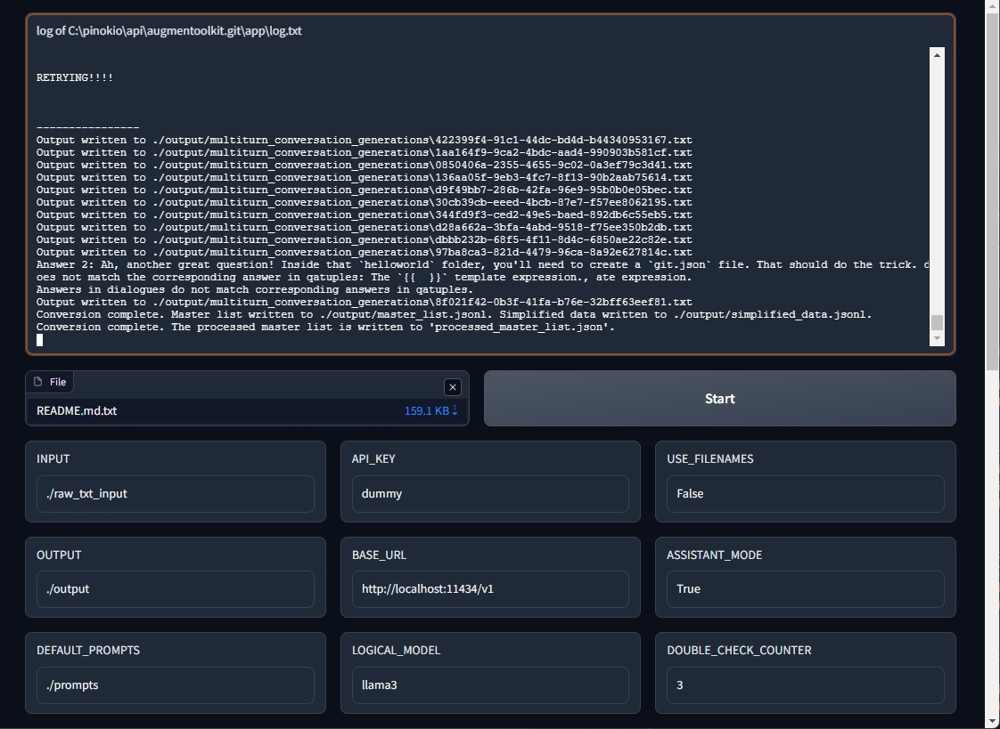
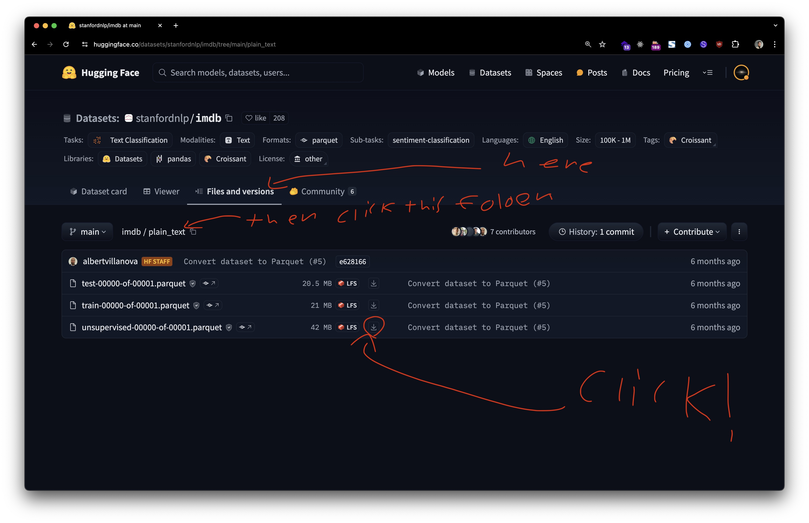
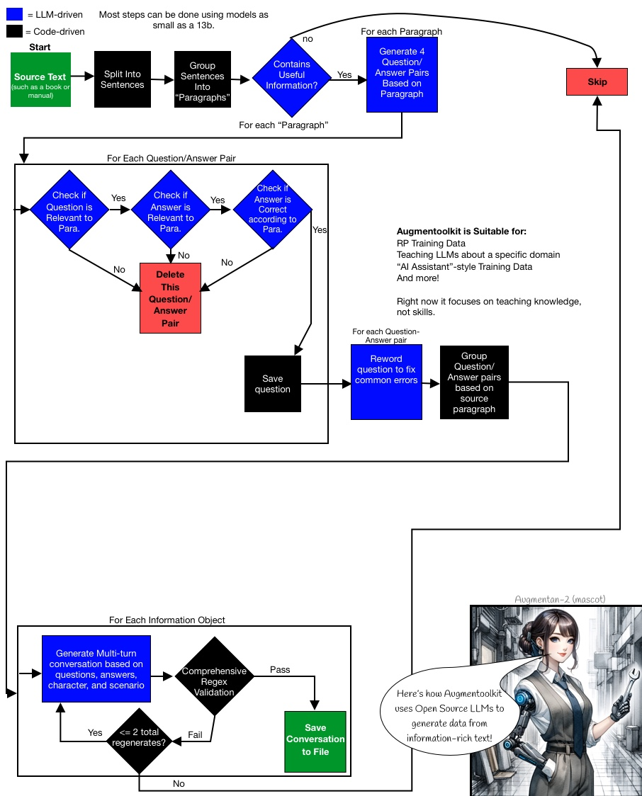
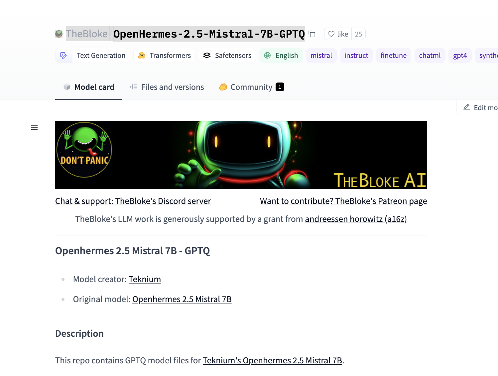

# Augmentoolkit — infinite domain-specific instruct data
Your custom LLMs need custom data. [Augmentoolkit creates quality data quickly, cheaply, and painlessly.](#benefits)

Now you can [turn any raw text](#quickstart) into a high-quality custom dataset for training new LLMs, using open-source AI. Make data gathering a painless step of the model creation process. Augmentoolkit is the easy-to-use, customizable, open-source, and cost-effective data generation solution. No OpenAI needed.

Augmentoolkit is an AI-powered tool that lets you create domain-specific data to finetune LLMs, using open-source AI.

---

### RECENT FEATURES UPDATE
Augmentoolkit can now train a small classification model on custom data — *on a cpu.* Basically:

1. LLM generates classification data based on a small subset of some real text you give it
2. Classifier is trained on the LLM data
3. Classifier is saved and evaluated against the LLM for accuracy
4. If the classifier is not good enough, add more data and train a new classifier. If it is good enough, the loop stops.

I used this pipeline to train a sentiment analysis distilbert model on the IMDb set, *without using the human labels.* **It got 88% accuracy** — only about [5% less than models trained on the human labels](https://huggingface.co/lvwerra/distilbert-imdb).

Creation of models using this pipeline costs like, maybe a dollar or two. Less than a coffee per classifier.

The goal of the classifier creator (name subject to change) is to make large-scale data classification and organization trivially easy. Classifiers are often used by more hardcore components of the machine learning community, and now with Augmentoolkit, you can create them at scale.

To get started, modify `classifier_trainer_config.yaml` and run `classifier_trainer_processing.py`!

**OK, back to your regularly-scheduled README.**

---


Cite:
[](https://zenodo.org/doi/10.5281/zenodo.11525927)

### Benefits
**Augmentoolkit makes LLM data easy.**
- **Cheap:** Augmentoolkit uses open-source LLMs, and so can be run on consumer hardware for hardly any cost, or cheaply via APIs like Together.ai.
- **Effortless:** Augmentoolkit can be run by putting some files in a folder, and then running a Python script. If that's too much, you can also use the graphical user interface. Previously-started runs are continued automatically, so you don't need to worry about interruptions costing you time and/or money.
- **Fast:** when using APIs, you can generate millions of trainable tokens in under an hour. Fully async code lets you get results quickly.
- **Anti-hallucination, quality data:** Augmentoolkit checks all important outputs for hallucinations and failures, ensuring high data quality throughout every generated dataset. Delicately-crafted few-shot examples force the open-source models used to be consistent and smart.

We've also done our best to **facilitate the step after you generate your data -- training your LLM:**
- **Train an AI for the cost of a dinner:** with the provided training configs, you can perform the equivalent of a full finetune of an AI,  on your own data, for a tiny sum of money. VRAM usage varies by model, of course -- and this can work in your favor.
- **Create your LLM in less than a day:** with reasonable dataset sizes and the provided training configs, LLM training can be done before the day is out. Iterate quickly and cheaply.
- **When you use the same recipe, you get the same bread:** Augmentoolkit datasets have been used successfully for professional consulting projects. Video documentation is linked in this README that shows exactly how to use this tool to do the same. The code, settings, and prompts you need is all here.
- **Train AI with confidence, *especially* if it's your first time:** between the video docs and active GitHub issues support, you can be confident you'll get a good LLM out of this.

Finally, **using the model you create should be easy and valuable:**
- **Training a model as a means of learning:** dealing with a large and complex subject that you need to master? Training an LLM with Augmentoolkit creates an assistant that understands the big picture of what you're trying to figure out. I have learned from AI I have created before, and you — or your users/employees/clients — can too.
- **Documented LLM setup (RAG included!):** from quantizing to chatting, it might take 30 minutes of following provided step-by-step video instructions (easy!) to set it up the first time you do this. The second it will likely take less than five or ten. Tutorials are taken seriously here.

## Demo video & Video Tutorials:
[3-Minute Demo Video Here](https://www.youtube.com/watch?v=m32fM8S_DeY&ab_channel=Heralax)

**Note that Video Documentation is currently built for Augmentoolkit, a sister project of Augmentoolkit built for the Verus community. The process of running it should be the same, and the process of training the LLM is definitely the same. But when it mentions "Augmentoolkit" and the Verus project, that is why.**

*Augmentoolkit-specific video docs are in the works.*

[Video Documentation 1 — Dataset generation](https://youtu.be/NI0QXWWtux8)

[Video Documentation 2 — Model Training, Quantizing, and Chatting](https://youtu.be/3YpO-n1U8qs)


## Table of Contents:
1. [Quickstart](#quickstart)
    - [Terminal](#terminal)
    - [Web UI](#web-ui)
2. [Vision (Introduction)](#vision)
3. [Usage](#usage)
    - [Installation](#installation)
    - [`config.yaml` step-by-step](#configyaml-step-by-step)
    - [Customization](#customization)
    - [Visual Explanation of Steps](#visual-explanation-of-steps)
    - [New Pipeline Usage Details](#classifier-creator)
4. [What to do with what you get out](#what-to-do-with-what-you-get-out)
5. [Roadmap](#roadmap)
6. [Self Promotion (Read if you're a Business!)](#for-businesses)
7. [Community](#community)
8. [Latest Update Info](#latest-update-info)
9. [Think this is cool? Connect with me elsewhere!](#think-this-is-cool-connect-with-me-elsewhere)
10. [Contributing](#contributing)
11. [Join A Discord for Dataset Generation!](#join-a-discord-for-dataset-generation)
12. [Using "Aphrodite mode" (deprecated)](#generating-locally)

## Quickstart

### Terminal

After installing the dependencies:

- Get the repo onto a computer with an internet connection
- Install its dependencies (`pip install -r requirements.txt`)
- Open `config.yaml`
- Paste your API key, favorite model name, and the endpoint URL of your preferred AI service, into the relevant fields inside `config.yaml`. Be sure to keep the quotes. Recommendation: [Together.ai with Hermes Mixtral works really nicely both as a LARGE_LOGICAL_MODEL and as the LOGICAL_MODEL](https://api.together.xyz/playground/chat/NousResearch/Nous-Hermes-2-Mixtral-8x7B-DPO).
- Open this project's folder in a command line and type `python processing.py` and hit enter (fires off the script version).

### Web UI

1. Install the dependencies (`pip install -r requirements.txt`)
2. Find the absolute path to the `raw_txt_input` folder
3. Run `export GRADIO_TEMP_DIR=<raw_txt_input_absolute_path>`
4. Run `python app.py`



## Vision

Dataset creation is currently the most painful, and most important, step of the finetune-creation process. Most people have to resort to either A) burning an obscene number of OpenAI API credits, or B) spending dozens, if not hundreds, of hours accumulating a hybrid dataset based off of your own conversations with bots. The OpenAI approach is based on a paid service (whose TOS you're violating) that can ban you at any second, whose writing style you probably hate, which is getting worse every month, and whose synthetic data critically lacks variety. Handwriting the examples is far too slow to iterate on, and does not scale at all, meaning you're missing out on huge potential performance increases that come with more data. If you're a company and you pay people to create examples in bulk, then it's possibly pricier than even OpenAI — also not scalable at all. And moreover, if we're literally creating machines that can write, why do we spend most of our time writing?

**Augmentoolkit** is meant to make high-quality data generation easy, fast, shareable, configurable, and for everyone. It is meant to allow the easy creation of datasets about any knowledge that exists in plain text. It is meant to allow models to bootstrap additional training data for themselves. It is meant to allow any enthusiast, regardless of computer strength, to contribute to the advancement of AI by generating swathes of data for cheap. It's meant to expand the possibilities of what finetunes can be built, by making data gathering as easy as running a script. Whether you're finetuning a company chatbot to understand your business's information, are creating an [AI ambassador for your community that can explain your mission and goals](https://finance.yahoo.com/news/introducing-llama-3-verusgpt-open-183700217.html?guccounter=1), or are doing something else entirely, Augmentoolkit exists to make your data problems a bit less problematic.

A flowchart of Augmentoolkit's operation can be found in the [Usage](#flowchart) section.

The high-level is: books or manuals in, information-rich conversations out. Train the model on the conversations, it learns the information. Extensive validation keeps hallucinations to a minimum.

More in-depth and jargon-filled:
Augmentoolkit takes human-written text with information in it, and turns it into instruct-tuning data. Basically, it uses LLMs to convert pretraining data into conversational multi-turn QA data: 
- It takes the input text, and splits it into chunks.
- It uses each chunk's information to generate questions that test the information, and it also generates answers to the questions that use the information. 
- It checks whether the generated questions and answers are accurate and only use information provided in the text (ensuring that the LLM did not hallucinate new information).
- Finally, it writes an interaction between a human and an AI, where the human asks the questions and the AI answers them.. 
- After checking that this conversation faithfully includes the original questions and answers, the result is saved as part of the newly-generated dataset.
You can see a flowchart of this process over in [Usage](#usage).


### Usage

#### Installation
First, get the repository onto your computer:
```
git clone https://github.com/e-p-armstrong/augmentool.git
```

Then, install the project's dependencies.
```
pip install -r requirements.txt
```
You may get some messages saying that torchvision and torchaudio require older versions of Pytorch. This should be safely ignorable.

If you want to use Aphrodite inside the code, you'll also need to add
```
pip install aphrodite-engine
```
However, it is recommended to just run whatever local inference engine you're using in another window, and put its API endpoint in config.yaml, rather than using the built-in aphrodite mode. That mode can be considered deprecated at this point.

NOTE it is likely more cost-effective for large scale dataset generation to rent GPUs for a couple bucks/hr on a service like Vast.ai or Runpod, than it is to use APIs like Together.ai. However, APIs are faster and require little setup. So the currently advised process is: experiment with APIs, and generate for production with rented compute.

I will make a video tutorial on local dataset generation with Augmentoolkit sometime soon.

**Augmentoolkit resumes previously-started runs if the output folder is not empty. Rename or move it elsewhere if you are not trying to continue interrupted dataset generation.**

#### Config.yaml, Step-by-Step

You can easily customize how a given run of Augmentoolkit proceeds by modifying `config.yaml`. The WebUI also has the ability to customize settings. Let's walk through each field in the YAML file so that you can understand how to change it to suit your needs:

First up, we have the API section:
```
API:
  API_KEY: your key here
  BASE_URL: https://api.together.xyz
  LARGE_LOGICAL_MODEL: meta-llama/Llama-3-70b-chat-hf
  LOGICAL_MODEL: meta-llama/Llama-3-70b-chat-hf
  QUANTIZATION_SMALL: "gptq"
  QUANTIZATION_LARGE: "gptq"
```

Field-by-field:
- `API_KEY` this is where you put the API key for your favorite API provider. If you're running a local server, put a dummy value in here so that the formatting of the request does not break.
- `BASE_URL` this is the base URL for the API provider you are using. Some possible values:
    - http://127.0.0.1:5000/v1/ <- local models.
    - https://api.together.xyz <- together.ai, which offers quality open-source models for cheap prices. Their service has reliability issues sometimes, however.
    - https://api.groq.com/openai/v1 <- Groq. They offer their API for free but have low rate limits.
    - https://api.openai.com/v1/ # <- OpenAI
    - anything else that accepts OAI-style requests, so basically any API out there (openrouter, fireworks, etc...)
- `LARGE_LOGICAL_MODEL` the name of the large model you want to use. This is the model that will be used for the final generation step. This should be a decently-strong model. The model used to power Augmentoolkit is separated into two models to save costs on easier steps early on in the pipeline. (This field is likely irrelevant if you're using a local server.)
- `LOGICAL_MODEL` the name of the model you want to use for the first few generation steps. It can be a decently cheap model, but stronger models will still result in better final outputs.
- `QUANTIZATION_...` change these if you are running with Aphrodite mode on. The method (e.g., "gptq", "awq") must match the kind of model quantization being used. `_SMALL` sets the quantization type for the `LOGICAL_MODEL` whereas `_LARGE` sets the type for the `LARGE_LOGICAL_MODEL`. **This setting does nothing and can be ignored if Augmentoolkit is not in Aphrodite mode (aphrodite mode is deprecated anyway since it is better to run it as a local server than using its code).


Next up, we have the `PATH` section:

```
PATH:
  INPUT: "./raw_text_input_vision_paper"
  OUTPUT: "./output"
  DEFAULT_PROMPTS: "./prompts"
  PROMPTS: ./prompts_vision_paper
```

Field-by-field:
- `INPUT` the relative path to the folder where the raw text input is stored. This is the folder that contains the text files that you want to use as input to the pipeline. The files can be any format, and some can be nested inside folders if you want, so very little cleanup work is required when working with a new source of data.
- `OUTPUT` the relative path to the folder where the output of the pipeline will be stored. This is the folder that will contain the dataset files (.jsonl) that are generated by the pipeline, as well as a complementary continued-pretraining dataset. Intermediate generations (useful for debugging or interpretability) are also here.
- `DEFAULT_PROMPTS` the relative path to the folder where the core prompts of Augmentoolkit are stored. This is the folder that contains the prompt files that are used throughout the pipeline. `DEFAULT_PROMPTS` is the fallback folder that Augmentoolkit will use if it can't find a prompt in the `PROMPTS` folder.
- `PROMPTS` the relative path to the folder where the prompts for the current run of Augmentoolkit are stored. Compared to `DEFAULT_PROMPTS`, `PROMPTS` is essentially an override: if a prompt is found in the `PROMPTS` folder, it will be used instead of the prompt of the same name in the `DEFAULT_PROMPTS` folder. This allows you to create different prompts for new kinds of input data that the original prompts may not be well-suited for. See `prompts_code_override` and `prompts_vision_paper_override` for examples of how this can be used.

Next, we have the `SYSTEM` section:
```
SYSTEM:
  CHUNK_SIZE: 1900
  USE_FILENAMES: False
  COMPLETION_MODE: false
  CONCURRENCY_LIMIT: 60
  DOUBLE_CHECK_COUNTER: 1
  FINAL_ASSISTANT_PROMPT_NO_RAG: |
   You are a helpful, friendly AI assistant.
  FINAL_ASSISTANT_PROMPT_RAG: |
   You are a helpful, friendly AI assistant.

   Context information is below:
   
   ----------------------
   {data}
  MODE: api
  STOP: true
  SUBSET_SIZE: 10
  USE_SUBSET: true
```

Field-by-field:
- `CHUNK_SIZE` is the maxmimum number of characters to use in a "chunk" of text that will be fed through the pipeline. A chunk is what questions are generated from — it's kinda the core building block of QA datasets built by Augmentoolkit.
- `USE_FILENAMES` determines whether the AI is allowed to see the name of the file from which each chunk of text/information was taken, when it's generating questions. If this is on, it means that questions may often have the format "What is X, according to filey?" This can be useful if your files are books — so you might get "How do you sabotage a car, according to Simple Sabotage by the OSS?" if it's on. Compare this to when it's off — in which case the question might simply be "How do you sabotage a car?" This is good to have if you want the bot to have some meta-knowledge, but should usually be left off. If you want the AI to know the authors behind files, then format the names as `textname, by author name`. The comma is important.
- `COMPLETION_MODE` is a boolean that determines whether prompts are sent to the provider in chat mode (default, what happens when it's set to `false`) or completion mode (what happens when it's set to `true`). Completion mode can produce higher-quality responses with some models, but many providers don't support it.
- `CONCURRENCY_LIMIT` is an integer; it's the maximum number of concurrent requests that can be made to the provider. This is useful for controlling costs and preventing rate-limiting.
- `DOUBLE_CHECK_COUNTER` is an integer; it's the number of times that the pipeline will double-check the questions it produces. For each QA pair, the majority vote goes: if it's positive, the question/answer pair is kept, if it's negative, the QA pair is tossed. Ties are tossed. This is a tradeoff parameter: higher means more quality but far higher cost. 3 is a good starting point.
- `FINAL_ASSISTANT_PROMPT_NO_RAG` is a setting used to control the form of the dataset produced at the very end. What you write here will be the system prompt of the AI in the portion of the dataset that does NOT have RAG supporting the outputs. This is where we get the LLM to rely on the knowledge we teach it.
- `FINAL_ASSISTANT_PROMPT_RAG` is like its NO_RAG cousin, except it's used in the portion of the dataset that DOES have RAG supporting the outputs. This is where we get the LLM to combine understanding with retrieved information to produce an answer. A key difference: wherever `{data}` appears, it will be replaced with the RAG context for each sample in the dataset. So place it where you want the context to appear in the prompt.
- `MODE` is the mode that the pipeline will run in. `api` is the default mode, and is used for running the pipeline with APIs supporting the OpenAI standard. `cohere` is also supported, and is used for running the pipeline with the Cohere API (BASE_URL does nothing in `cohere` mode).
- `STOP` is a boolean that determines whether the pipeline uses stop tokens or not. You should always have this set to `true` unless you're using an API that arbitrarily limits the number of stop tokens you can use, like OpenAI.
- `SUBSET_SIZE` controls the number of chunks fed through the pipeline if USE_SUBSET is on. This is useful for debugging and testing quickly and cheaply — only the first `SUBSET_SIZE` chunks will be processed.
- `USE_SUBSET` is a boolean that determines whether the pipeline uses a subset of the input data.

Note:
```
SKIP:
  QUESTION_CHECK: False
  ANSWER_RELEVANCY_CHECK: True # turn on if using the negative question prompt override
```

This lets you control whether you want to skip certain steps of the pipeline. QUESTION_CHECK should generally not be skipped under any circumstances, but ANSWER_RELEVANCY_CHECK may be skipped if you are using the "negative" prompt overrides, by default located in `./prompts_override_negative_question`. So, turn any one of these on if you want the corresponding step to simply be skipped. These options allow a degree of control flow control, without touching code.

#### Classifier Creator
**NEW!**

The classifier creator lets you train a whole classification model in minutes. Generation can be done locally or via an API, while model training is done locally on the CPU (classifiers are just that easy to train!)

When do you want a classifier? Maybe you want to go through a dataset and classify data as "high-quality" or "low-quality" and train on only the high-quality stuff. Or, maybe you want to make some custom moderation for an application. Or, maybe you want to hunt through a large amount of text for specific kinds of information. Classifiers are old-school, but they're pretty cool and surprisingly useful nonetheless.

Here's how to run it (a quickstart).

`pip install -r requirements.txt`

Then, modify `classifier_trainer_config.yaml` to have the right API key and base url.

Then, download the IMDb dataset from Hugging Face:



Then run: `python classifier_trainer_processing.py`

Prompts for this new pipeline can be found in `prompts_classifier`.

Most of the `config` settings are the same as vanilla Augmentoolkit, but here are the points of difference:

- `LOGICAL_MODEL` In this pipeline, LOGICAL_MODEL handles the majority of the classification used to build the training data for your custom classifier. A model like Llama 3 8b works great.
- `LARGE_LOGICAL_MODEL` is used to 1) create the "rules" that the LLM classifier follows (based on your description of the task and what the classes mean). The large logical model is also used to do the classifications during the model evaluation phase, to make sure that the classifier is high quality and is not just learning the stupidity of a smaller model.
- `REQUIRED_ACCURACY: 0.90` under the `SYSTEM` heading, this field (less than 1) is the percentage of classifications that a trained classifier model must get "right" (compared to the LLM's classification) in order to pass and break of the continual improvement loop. Dpeending on your chosen classifier model and task, you may want to set this a bit lower — some of them can be pretty small.
- `CLASSIFICATION`
  - `CLASSES` is a list of strings that are the names of the classes the model will be classifying your text with. So, `["negative", "positive"]` for instance. These will appear as `0` and `1` respectively in the actual training data. This early version of the pipeline only supports binary classification (2 classes) BUT it has been built to make adding more classes relatively easy in the future, so expect that to arrive.
  - `DESC` is a string that describes what the classes mean. Something like `"Classify whether the text (a movie review) is positive or negative."` or `"Whether a text expresses positive or negative emotion."` or `Classify the text as metadata if it is clearly metadata, tables of contents, publication information, copyright info — anything not the actual meat of a book or article. Classify it as content if it is clearly content that actually means something. If it contains both, classify it as metadata.`
  - `PREDICT_ON_WHOLE_SET_AT_THE_END` is a boolean that decides whether or not to run the newly-trained classifier on the whole input text at the end. Turn this on if you are feeding Augmentoolkit the same data you want to eventually sort into two different classes..
`TRAINING:`
  - `MODEL_PATH` the path to the model on Hugging Face that you want to train your classifier on. This pipeline is tested on `distilbert-base-uncased`
  - `TRAIN_SET_SIZE` how many chunks to take for the first training run. A decent default value is 500.
  - `TRAIN_SET_INCREMENT` how many new chunks to add each time the classifier fails to match the LLM's performance
  - `TEST_SET_SIZE` How many test samples are taken when your new classifier's performance is being evaluated against the LLM. The number of times the classifier agrees with the LLM determines the accuracy score.
  - `TRUNCATION_TYPE` Some chunks are too big for the context length of your classifier model. So you can truncate. The options: head-tail (take first few tokens and a bunch of the ones at the end); end truncation (cut off excess stuff that does not fit into the chunk size at the end)
  - `MAX_ITERS` To avoid getting into an infinite money-spending loop, this is where you set an integer that marks the maximum number of datagen+training runs that will be performed. Note that the classifier creator is *much* cheaper than Augmentoolkit, so this can be set pretty high without fear. 5

**NOTE that the classifier creator can also take .json, .jsonl, and .parquet files as input, if they have a "text" column! This lets you use off-the-shelf datasets from Hugging Face, such as [Enron emails](https://huggingface.co/datasets/jacquelinehe/enron-emails) or [FineWeb](https://huggingface.co/datasets/HuggingFaceFW/fineweb)!**

## Important Files (If you're modifying the code)

Starting from more common things to less common things:

- `processing.py` is the main file that runs the pipeline. It's where the core control flow of the pipeline is defined.
- `control_flow_functions.py` is where a large number of the helper functions that the pipeline uses are defined. Arguments, sampling parameters, and the control flow of each individual step are defined here. The difference between this and `processing.py` is that `processing.py` is the control flow of the pipeline as a whole, while `control_flow_functions.py` is mostly the control flow of each individual step. **This is where the `output processors` are defined -- if you changed prompts and are getting generation failed issues, this is where you need to look.** Look at `parse_validation_step` for an example of what an output processor is like, basically it takes the LLM response as an input and returns a QA pair.
- `engine_wrapper_class.py` contains a class that serves as a single interface for many different LLM APIs. This is where you would need to change the code if you wanted to use a different API provider that is not OpenAI compatible.
- `generation_step_class` contains a class that stores the parameters for a single generation step. A generation step basically holds some sampling parameters, a prompt, and an engine wrapper, and can call that engine wrapper with those settings. Typically you'll change this to add additional logging if you're encountering errors after modifying a step -- the way calls to LLMs work in Augmentoolkit is that a generation step object is created with a path to a prompt and some sampling parameters, and then the object's .generate() method is called with the arguments for a specific call to the LLM. 
- There are some other miscellaneous utility functions in the `generation_functions` folder.
- `app.py` contains the gradio WebUI code. This is the graphic interface. The fields are based off of `config.yaml`.

### Visual Explanation of Steps
Here is a flowchart detailing how a typical run of Augmentoolkit may proceed. The source text can be anything with information you can ask questions about.


## What to do with what you get out

The important files to look out for in your `OUTPUT` folder are `simplified_data_no_rag.jsonl`, `simplified_data_rag.jsonl`, and `pretraining.json`. These are what you will most commonly use for training. The other top-level files are there incase you want more information, such as the chunk and name of the file that each conversation was generated from. But for training, you will want `simplified_data_no_rag.jsonl`, `simplified_data_rag.jsonl`, and `pretraining.json`. All are already formatted for use with the [Axolotl](https://github.com/OpenAccess-AI-Collective/axolotl) open-source training library. All you need to do is use these datasets like how the provided configs in `_model_training_configs/` are used.

The format of the conversational files is called "shareGPT", and is a common format across many datasets. `pretraining.json` however is formatted as pretraining data. To bake factual information into an LLM, it is recommended you use a full finetune or (cheaper) GaLore tuning, combined with continued pretraining on the source text + the instruct data that Augmentoolkit generates. If you want a more in-depth example, check out the provided configs, or the second video of the [Video Documentation](https://youtu.be/3YpO-n1U8qs).

In a recent update, Augmentoolkit gained the functionality where you get data from the generation of questions, filtering of input chunks, and conversation generation, as well. These can be identified by being `.jsonl` files with `_DATAGEN_OUTPUT` in their filenames. You'll understand what exactly they are when you look at one.

They're in ShareGPT format for easy training, and can be used to bulk up a training run by acting as yet more diverse data on the given subject. They can also be used to make LLMs that are experts in running as part of Augmentoolkit specifically — train a model on enough of these, and you will get a powerful tool for local inference.

## Roadmap

In the coming weeks and months, Augmentoolkit will be expanded with additional pipelines, capabilities, and updates. I'm working in collaboration with AlignmentLab AI for some of this!

One specific pipeline coming up is ultra-long context instruct data. Let me know if there are other kinds of pipelines you'd like to see, and I'll add them too!

Do you have data generation or data cleaning code? I welcome PRs adding new pipelines! The only thing you need to do with it is 1) ensure that it has a `config.yaml` file of some kind for settings, 2) ensure it has its own script (like `processing.py`), and 3) put any utility functions in the `augmentoolkit/` directory.

Let's make the best data generation tool in the world!

## For Businesses
I work with startups and companies that want to create (or improve) specialized LLMs using lots of quality training data. Do you need a dataset for your business's AI? Or do you want to apply AI models *that **you** own* to an area which generalist ones are struggling with? I'd be happy to help you painlessly create this custom AI, and the documented tools to build more of them. Given that I made the original version of this thing, I'm probably the best person in the world for this task. You can schedule a quick call to talk about your needs with me using this Calendly link: [https://calendly.com/evanpeterarmstrong/discovery-call](https://calendly.com/evanpeterarmstrong/discovery-call).

*Note* The base version Augmentoolkit is fully open sourced and MIT-licensed. The consulting option is for people who want a bespoke modification and quality results, fast (it took 5 months of learning and iteration for me to master open source model pipelines enough to make Augmentoolkit work well, on top of my existing ML experience). If you're a hobbyist and have time to experiment with its base version for casual or personal uses, by all means go for it!

## Community

Changing Augmentoolkit usually requires a lot of prompting of open-source LLMs. This, and many other aspects of developing with AI, are tricky to get a handle on. I'm [making a community](https://www.skool.com/placeholder-ai-group-name-1872/about) to make this easy for you.

This community isn't the typical fake guru "AI tools" hype BS. It's by and for developers.

Currently we have a full video course on open-source prompting, weekly Q&A calls about developing with AI, and optional monthly 1-on-1s with myself, where I help you with your project in any way I can. There's a tight-knit group of professionals and hobbyists like you.

[I'd love to have you there. Follow this link to see the landing page and decide if it's something you might be interested in joining.](https://www.skool.com/placeholder-ai-group-name-1872/about)

## Latest Update Info

Augmentoolkit has received a major update as of Jun 12, 2024. Two whole new prompt override folders let you generate data designed to make your model smarter and more detailed, while also getting more instruct data for your pretraining buck. Tweaks have been made based on hard-earned experience to optimize for final model quality. Prompt overhauls make the pipeline more flexible and powerful. YAML now is used instead of JSON for prompts because of newline support. An early version of an entirely new datagen program, built to create datasets even without any text input, can be found in `./pure_synthetic_pipeline`. There's better logging for common errors. Oh, and the code has been almost entirely refactored!

In the most recent update, RP mode was removed. You can revert to previous versions if you need that. The code is now much cleaner and more maintainable as a result of this.

Many of these changes are inspired by the recently-released [Verustoolkit](https://github.com/e-p-armstrong/verustoolkit) which I developed for (and as part of) the Verus community. Verustoolkit is specific for Verus, but it's open-sourced, and so I ported its key improvements back here. Go check it out if you're interested the future of blockchain technology!

## Think this is cool? Connect with me elsewhere!

If you think this project is cool and useful, great! I'm genuinely happy that you're interested by my work. If you're really interested by this project you might be interested by some of my other endeavors:

- [A newsletter/blog about Prompt Engineering Open-Source models — the art and science that is the backbone of Augmentoolkit and complex LLM projects like it. I also consult for prompt engineering, if you're curious.](https://promptingweekly.substack.com/)
- [I sometimes post stuff and sometimes join spaces on X/Twitter](https://twitter.com/e_p_armstrong)
- [Let's connect on LinkedIn!](https://www.linkedin.com/in/evan-armstrong-1a84b3200/)
- [I'm pretty active on TheBloke's discord server and a bunch of other AI discords. Find me as @heralax!](https://discord.gg/prYqwywP)
- [By the way, did I mention I consult? :) I might be able to help your AI business get even better, using Augmentoolkit or straight-up prompting. We should chat at least and connect](https://calendly.com/evanpeterarmstrong/discovery-call)
- Email me at: evanpeterarmstrong@gmail.com

## Contributing

Contributions are appreciated! Whether it's a new API endpoint, or a set of prompts you've found to work really well, or an entirely new pipeline, please submit a PR! Reviews are fast here. Anything that can further the goal of democratized dataset generation is welcome.

## Join A Discord for Dataset Generation!
MrDragonFox -- one of the moderators of the Mistral and TheBloke Discords -- has a server where he's working on a new quantization engine. There's a corner to discuss Augmentoolkit there! Come check it out and connect at [https://discord.com/invite/foxengine-ai](https://discord.com/invite/foxengine-ai)!

## Generating Locally

One constraint of local generation is that you can only run one model at once. Augmentoolkit typically uses two different models: a small one for bulk work, and a large smart one for tough tasks. 

- First off, make sure you're on a Linux operating system. If you want local generation with a non-Linux operating system, it is recommended that you run a local inference engine with an openai-compatible API, and then point Augmentoolkit at the local inference engine by changing the BASE_URL.
- Then install aphrodite engine and get it working. That's a whole process, you can find the details on [their repo](https://github.com/PygmalionAI/aphrodite-engine/tree/main)
- Follow the first few steps of the quickstart: get the repo onto your computer and install its dependencies.
- Open the file `config.yaml` and change the MODE to "aphrodite"

- In `config.yaml`, change the MODEL field to a HuggingFace Path to a model. Make sure it has a large enough context window! And be sure to use the right quantization mode for your chosen model. The model should have some indication of what quantization type it uses. Also, change `COMPLETION_MODE` to True


- Run `(aphrodite_use)_processing_phase_1.py`
- Run `(aphrodite_use)_processing_phase_2.py` once phase 1 finishes.
- Control + C when it logs stuff about saving dataset files to `simplified_data.jsonl`. It seems that something about Aphrodite's code has changed since I implemented it in here, and it no longer automatically exits the script.

I'm considering removing aphrodite mode and just letting local inference be done via local OAI-compatible servers, but incase people want it specifically I'm leaving it for now. I hope that this set of instructions is complete enough to follow.

Q: Why do I have to run this in two phases?
A: Because it's difficult to switch between two different models when doing local inference.
